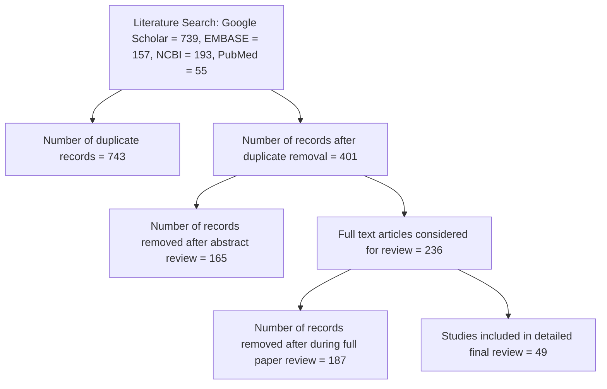
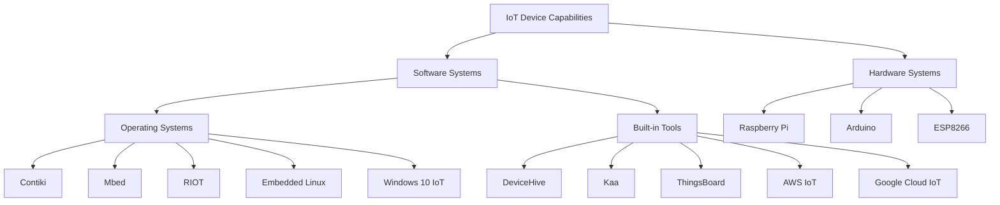
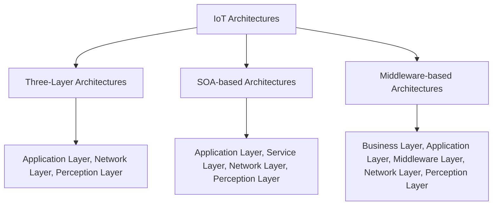
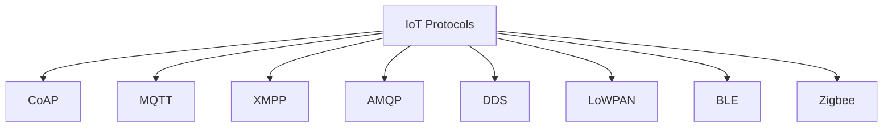
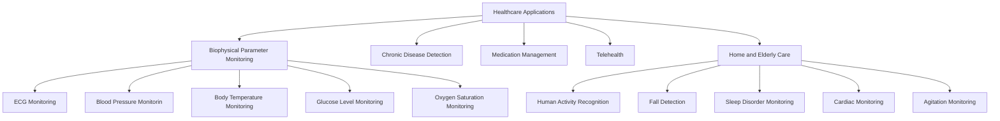

# 物联网设备能力、架构、协议和医疗保健领域的智能应用：综述
>**[*Internet of Things Device Capabilities, Architectures, Protocols, and Smart Applications in Healthcare Domain: A Review*](https://arxiv.org/abs/2204.05921). By Md. Milon Islam, Sheikh Nooruddin, Fakhri Karray, *Fellow, IEEE*, and Ghulam Muhammad, *Senior Member, IEEE*.**
### 摘要-
如今，互联网已几乎遍及世界上每一个国家，并对人们的生活产生着前所未有的影响。在无线通信时代，物联网（IoT）因其多样化的应用而越来越受欢迎，并受到从业人员和学术界的高度关注。物联网是一项能让日常事物变得更精明、日常计算变得更智能、日常通信变得更有洞察力的技术。本文简要展示了最常见、最流行的物联网设备功能、架构和协议，以便为该领域的研究人员提供一个清晰的物联网技术概览。详细介绍了常见的物联网设备功能，包括硬件（Raspberry Pi、Arduino 和 ESP8266）和软件（操作系统和内置工具）平台。最近得到广泛发展和使用的架构包括三层架构、基于 SOA 的架构和基于中间件的架构。本研究还展示了物联网的流行协议，包括 CoAP、MQTT、XMPP、AMQP、DDS、LoWPAN、BLE 和 Zigbee，这些协议经常被用来开发智能物联网应用。此外，本研究还深入概述了基于物联网技术的潜在医疗保健应用，以解决各种医疗保健问题。最后，本文总结了最新知识，强调了尚未解决的问题和不足之处，并提出了进一步研究的建议，这对任何有志于在这一领域开展工作并取得突破性进展的人来说都将大有裨益。
### 索引术语-
物联网、设备功能、物联网架构、通信协议、医疗保健应用。
## I. 导言
物联网的概念是指一系列与互联网相连的设备，这些设备具有计算能力，易于识别，并且可以通过互联网共享数据，而无需物理接触。物联网革命带来了前所未有的设备间互联，使智能环境得以发展。与现有网络的智能连接，以及利用网络资源进行情境感知信息处理，是物联网的重要组成部分、是物联网[^1]的重要组成部分、[^2]。物联网通过允许物理物体相互 "对话"、交换信息数据和做出选择，使物理物体能够看到、听到、思考和执行各种任务。物联网的概念是利用其广泛的技术，包括嵌入式应用、互联网协议和应用、无线通信、分布式网络和传感器技术，将这些设备从传统设备转变为智能设备、[^3]、[^4]。当前的互联网发展成为互联对象网络的一个重要进步是，它不仅通过执行、控制和监测与物理环境接触，也不仅仅是从环境中提取信息、它还利用传统的网络要求来加强数据传输、预测分析和通信、和通信[^4]、[^5]。物联网涵盖大量应用，包括医疗保健、汽车、公用事业、智能城市、可穿戴设备、智能家居和智能农业[^6]、[^7]。目前，许多研究项目、企业和商家都在开发各种物联网功能，以满足随着物联网的快速发展而出现的不断增长的需求。
[^1]:Y. Song, F. R. Yu, L. Zhou, X. Yang, and Z. He, “Applications of the Internet of Things (IoT) in Smart Logistics: A Comprehensive Survey,” IEEE Internet Things J., vol. 8, no. 6, pp. 4250–4274, Mar. 2021.
[^2]:D. C. Nguyen et al., "6G Internet of Things: A Comprehensive Survey," IEEE Internet Things J., vol. 9, no. 1, pp. 359-383, 1 Jan.1, 2022.
[^3]:F. Guo, F. R. Yu, H. Zhang, X. Li, H. Ji and V. C. M. Leung, "Enabling Massive IoT Toward 6G: A Comprehensive Survey," IEEE Internet Things J., vol. 8, no. 15, pp. 11891-11915, 1 Aug.1, 2021.
[^4]:L. Chettri and R. Bera, “A Comprehensive Survey on Internet of Things (IoT) Toward 5G Wireless Systems,” IEEE Internet Things J., vol. 7, no. 1, pp. 16–32, Jan. 2020.
[^5]:M. Nasr, M. M. Islam, S. Shehata, F. Karray, and Y. Quintana, “Smart Healthcare in the Age of AI: Recent Advances, Challenges, and Future Prospects,” IEEE Access, vol. 9, pp. 145248–145270, 2021.
[^6]:F. John Dian, R. Vahidnia, and A. Rahmati, “Wearables and the Internet of Things (IoT), Applications, Opportunities, and Challenges: A Survey,” IEEE Access, vol. 8, pp. 69200–69211, 2020.
[^7]:P. Asghari, A. M. Rahmani, and H. H. S. Javadi, “Internet of Things applications: A systematic review,” Comput. Networks, vol. 148, pp. 241–261, Jan. 2019.

医疗保健平台被描述为硬件和软件组件的组合，这些组件协同工作，为人们（包括医疗保健专业人员和患者）提供广泛的医疗保健服务和应用、以高效、广泛的方式促进健康[^8]、[^9]。如今，有许多医疗保健框架集成了各种技术，利用各种无线通信技术（包括 ZigBee、5G、蓝牙和 USB）监测多种人体生物物理症状和环境数据、5 G、蓝牙和 Wi-Fi [^10]、[^11]。物联网技术为医疗保健系统提供支持，使人们能够留在智能家居中接受实时监控，而不是被送往医院或诊所，从而降低急诊成本[^12]、[^13]。物联网技术在设计智能医疗系统方面有许多优势，如方便就医、确保病人舒适和安全、减轻病人在医院的负担等。一般来说，物联网可实现智能设备网络、云应用和解决方案，使数据传输和存储变得更容易。物联网在医疗保健领域最有前景的应用包括远程监控、智能医疗设备、智能家居以及可穿戴设备。近年来，学术界和业界对包括医疗保健领域在内的物联网互操作性进行了多项研究，重点是通信协议的标准化，以提供不同设备的互操作性、网络和数据结构的互操作性[^14]、[^15]。为确保医疗系统的 QoS，物联网应包含一些方面，如可靠通信协议的标准化、增强型移动和可穿戴设备、以及低成本和低功耗嵌入式处理器[^16]、[^17]。物联网通信架构可以成为分散式普适医疗应用的主要使能机制、[^18]、[^19].
[^8]:G. Marques, R. Pitarma, N. M. Garcia, and N. Pombo, “Internet of Things Architectures, Technologies, Applications, Challenges, andFuture Directions for Enhanced Living Environments and Healthcare Systems: A Review,” Electronics, vol. 8, no. 10, p. 1081, Sep. 2019.
[^9]:F. Alshehri and G. Muhammad, "A Comprehensive Survey of the Internet of Things (IoT) and AI-Based Smart Healthcare," IEEE Access, vol. 9, pp. 3660-3678, 2021.
[^10]:S. Ketu and P. K. Mishra, “Internet of Healthcare Things: A contemporary survey,” Journal of Network and Computer Applications. 2021.
[^11]:M. M. Dhanvijay and S. C. Patil, “Internet of Things: A survey of enabling technologies in healthcare and its applications,” Comput. Networks, vol. 153, pp. 113–131, Apr. 2019.
[^12]:R. Maskeliūnas, R. Damaševičius, and S. Segal, “A Review of Internet of Things Technologies for Ambient Assisted Living Environments,” Futur. Internet, vol. 11, no. 12, p. 259, Dec. 2019.
[^13]:J. Cahill, R. Portales, S. McLoughin, N. Nagan, B. Henrichs, and S. Wetherall, “IoT/Sensor-Based Infrastructures Promoting a Sense of Home, Independent Living, Comfort and Wellness,” Sensors, vol. 19, no. 3, p. 485, Jan. 2019.
[^14]:Y. Yang, H. Wang, R. Jiang, X. Guo, J. Cheng and Y. Chen, "A Review of IoT-enabled Mobile Healthcare: Technologies, Challenges, and Future Trends," IEEE Internet Things J., doi: 10.1109/JIOT.2022.3144400.
[^15]:H. Abdelghaffar and M. Abousteit, “Internet of Things (IoT) Interoperability Success Criteria,” Int. J. Enterp. Inf. Syst., vol. 17, no. 1, pp. 85–105, Jan. 2021.
[^16]:Z. N. Aghdam, A. M. Rahmani, and M. Hosseinzadeh, “The Role of the Internet of Things in Healthcare: Future Trends and Challenges.,” Comput. Methods Programs Biomed., vol. 199, p. 105903, Feb. 2021.
[^17]:M. N. Bhuiyan, M. M. Rahman, M. M. Billah, and D. Saha, “Internet of Things (IoT): A Review of Its Enabling Technologies in Healthcare Applications, Standards Protocols, Security, and Market Opportunities,” IEEE Internet Things J., vol. 8, no. 13, pp. 10474–10498, Jul. 2021.
[^18]:M. Rath and B. Pattanayak, “Technological improvement in modern health care applications using Internet of Things (IoT) and proposal of novel health care approach,” Int. J. Hum. Rights Healthc., vol. 12, no. 2, pp. 148–162, May 2019.
[^19]:B. Pradhan, S. Bhattacharyya, and K. Pal, “IoT-Based Applications in Healthcare Devices,” J. Healthc. Eng., vol. 2021, pp. 1–18, Mar. 2021.

本文旨在详细介绍物联网设备的功能、架构、协议和医疗保健应用等基本问题。物联网设备包含硬件和软件平台的所有必要组件。硬件平台介绍了最流行的便携式处理设备，如 Raspberry Pi、Arduino 和 ESP8266，重点介绍了一些重要特性，包括功耗要求、内存容量和处理能力。软件平台主要描述用于小型嵌入式设备的操作系统和用于物联网相关任务的内置软件。这里介绍的操作系统包括 Contiki、Mbed、RIOT、Embedded Linux 和 Windows 10 IoT，以及它们的显著特点。物联网智能应用中流行且广泛使用的内置工具包括 DeviceHive、Kaa、ThingsBoard、AWS IoT 和 Google Cloud IoT。三层架构、基于 SoA 的架构和基于中间件的架构等物联网架构将为您提供最前沿的见解。三层架构包含感知层、网络层和应用层。此外，基于 SoA 的架构包括服务层和三层架构的各层。中间件层和业务层是基于中间件的架构在三层架构基础上的附加层。这里还演示了物联网通信协议，以提供通信接口概览。本文介绍的流行的八种协议是 CoAP、MQTT、XMPP、AMQP、DDS、LoWPAN、BLE 和 Zigbee。本文展示了使用物联网技术对个人进行监测、诊断和治疗的最有前途的医疗保健应用。主要应用包括生物物理参数监测、慢性病检测、药物管理、远程医疗以及家庭和老年人护理。本文探讨了物联网技术当前面临的挑战和潜在的未来趋势，以找出开发智能应用的研究空白和潜在解决方案。本文的主要贡献如下。
1. 全面讨论物联网设备的功能，突出硬件和软件系统领域，包括处理能力、操作系统和内置工具。
2. 探讨物联网架构的核心技术，这些技术是物联网不同应用领域的基本问题，并对此进行了详细讨论。
3. 分析处理网络数据传输问题的典型物联网通信协议，并概述每种协议。
4. 深入分析基于物联网的最新和最有前景的医疗保健应用，这些应用采用不同的架构和协议，用于医院和智能家居环境中对患者的监测、诊断和治疗。
5. 对物联网应用方法的主要开放问题以及未来趋势进行研究，为智能应用提供进一步的研究范围。

本文其余部分内容如下。第二节展示了论文的收集和选择标准。第三节提供物联网设备功能的概念，并适当说明硬件和软件平台。第四节介绍了近期用于开发智能系统的架构。第五部分展示了通常用于在互联网上传输数据的物联网协议。第六节简要介绍了物联网技术在医疗保健领域的应用。第七节展示了物联网技术的公开讨论，以及当前面临的挑战和未来可能开展的工作。第八节为本文的结论。
## II. 论文收集和选择
本研究仅限于 2017 年至 2022 年期间在知名国际刊物上发表的、以英语撰写的同行评审研究成果。本研究使用的一些重要资料来源包括谷歌学术、EMBASE、PubMed 和 NCBI。使用最多的搜索关键词是 "物联网概述"、"物联网安全问题"、"物联网架构"、"医疗保健中的物联网"、"物联网操作系统"、"物联网面临的挑战"、"工业物联网 "和 "使用物联网的智能应用"。

图 1. 文章终审筛选流程图。最终选择是根据重复记录、摘要审查和论文全文审查进行的。

我们还手动搜索了各种网络搜索引擎，如 Google、DuckDuckGo 和 Bing，以及书籍、文章、在线杂志和知名来源的在线报告，以提供各种统计数据。我们对论文的摘要、标题、关键词和整体结构进行了分析，以剔除重复内容。我们还剔除了超出本工作范围的出版物。图 1 显示了详细综述论文从初始搜索阶段开始的文章筛选过程。从最初大量的搜索结果中，只有极少数论文被选中进行审阅。被剔除的论文都是基于重复和超出本研究重点的原因。
## III. 物联网设备功能
系统（GPS）和 LED 灯等智能应用。大多数物联网设备都会以各种形式产生大量数据，这些数据经数据分析引擎分析后，可携带重要信息，用于指导本地或远程活动。突出硬件和软件平台的物联网设备功能如图 2 所示。下文将简要展示包括硬件和软件平台在内的设备功能。
### *A.硬件*
根据手头任务的不同，物联网硬件组件的形状和大小也各不相同。例如，核心 CPU 用于操作手机，传感器用于感知物理环境中的数据，而数据则在边缘设备上进行处理和分析。在有线模式下，硬件是物联网平台的重要组成部分，随着物联网的发展，这些设备的功能也日益重要。这里介绍的是广泛用于开发物联网应用的主要硬件套件，重点是处理能力、内存容量和功耗要求等特性。

图 2. 物联网设备的功能包括硬件平台和软件平台。硬件平台包括多种类型的微型处理设备，如 Raspberry Pi、Arduino 和 ESP8266。软件模块包括多个操作系统和内置工具。

#### *(i)Raspberry Pi*
Raspberry Pi 是一系列单板计算机，它将大量处理能力压缩到一个小盒子中，并提供类似台式机的功能 [^20]。Raspberry Pi 的组件因版本而异。Raspberry Pi B+ 型号有四个 USB 端口、两个摄像头端口、一个以太网端口、一个音频插孔端口和一个 HDMI 端口。为实现实际案例研究，Raspberry Pi 有 17 个通用输入输出（GPIO）引脚，可连接 LED、传感器、开关和电机等任何电子元件。Raspberry Pi 所需的最低逻辑电平几乎为 3.3V。一般来说，它在 Raspbian 操作系统上运行。此外，它还兼容其他操作系统，如 Lakka、RaspBSD 和 RetroPie [^21] 。Raspberry Pi 支持的编程语言有 Python、Java、C++ 和 C。GPIO 引脚与 Linux 操作系统的结合使该设备具有很大的灵活性，为用户提供了很多选择。标准 Raspberry Pi 型号的 CPU 速度为 700 MHz 至 1.4 GHz，内存容量为 256 MB 至 4 GB，所需功率为 2.5 Amp。这些指标根据 Raspberry Pi 型号的版本而有所不同。[^22]由于具有高连接性、易用性、便携性、低功耗、高灵活性和高传输性，Raspberry Pi 非常适合广泛的应用。不过，该器件没有电源按钮，无法在闲置时保持休眠状态，也没有内置 ADC，而且很难复制。
[^20]:J. W. Jolles, “Broad‐scale applications of the Raspberry Pi: A review and guide for biologists,” Methods Ecol. Evol., vol. 12, no. 9, pp. 1562–1579, Sep. 2021.
[^21]:A. Polianytsia, O. Starkova, and K. Herasymenko, “Survey of hardware IoT platforms,” in 2016 Third International Scientific-Practical Conference Problems of Infocommunications Science and Technology (PIC S&T), 2016, pp. 152–153.
[^22]:V. Vujovic and M. Maksimovic, “Raspberry Pi as a Wireless Sensor node: Performances and constraints,” in 2014 37th International Convention on Information and Communication Technology, Electronics and Microelectronics (MIPRO), 2014, pp. 1013–1018.
#### *(ii)Arduino*
Arduino 是一种流行且常用的开源电子框架，它基于简单的硬件和软件，可用于开发电子项目。它提供的产品种类繁多，从简单的 8 位微控制器板到可穿戴技术、物联网组件和 3-D 打印[^23]。完成任何任务的指令集都是通过微控制器执行的。市场上有多种 Arduino 版本，如 UNO、micro、pro、mega 和 nano，用于电子系统开发。它可轻松兼容 MAC、windows 和 Linux 平台。在集成开发环境[^24]的支持下，使用 B 型 USB 电缆对 Arduino 板进行编程。Arduino 支持的语言是 C++，通过使用头文件来控制传感器和致动器等外设的基本问题。Arduino Uno 有模拟引脚、数字引脚、USB 连接、复位按钮、晶体振荡器和电源插孔。Arduino 非常适合感知来自物理环境的数据，即模拟数据[^25]。
[^23]:H. K. Kondaveeti, N. K. Kumaravelu, S. D. Vanambathina, S. E. Mathe, and S. Vappangi, “A systematic literature review on prototyping with Arduino: Applications, challenges, advantages, and limitations,” Comput. Sci. Rev., vol. 40, p. 100364, May 2021.
[^24]:D. K. Halim, T. C. Ming, N. M. Song, and D. Hartono, “Arduino-based IDE for Embedded Multi-processor System-on-Chip,” in 2019 5th International Conference on New Media Studies (CONMEDIA), 2019, pp. 135–138.
[^25]:S.-M. Kim, Y. Choi, and J. Suh, “Applications of the Open-Source Hardware Arduino Platform in the Mining Industry: A Review,” Appl. Sci., vol. 10, no. 14, p. 5018, Jul. 2020.
#### *(iii)ESP8266*
ESP8266 是一款支持 Wi-Fi 的迷你型设备，具有完整的 TCP/IP 协议栈和微控制器功能，常用于物联网环境 [^26] 中的嵌入式开发。该设备可承载一个应用程序，将所有 Wi-Fi 网络服务卸载到另一个底层硬件。ESP8266 的 Wi-Fi 模块预编程了 ESP-AT 命令集固件，使任何 Arduino 设备都能获得 Wi-Fi 连接。它的运行频率为 80 MHz，使用基于 Tensilica Xtensa L106 的 32 位 RISC CPU（精简指令集计算机）。ESP8266 的启动 ROM、指令 RAM 和数据 RAM 大小分别为 64 KB、64 KB 和 96 KB。
[^26]:J. Mesquita, D. Guimaraes, C. Pereira, F. Santos, and L. Almeida, “Assessing the ESP8266 WiFi module for the Internet of Things,” in 2018 IEEE 23rd International Conference on Emerging Technologies and Factory Automation (ETFA), 2018, pp. 784–791.

串行外设接口（SPI）可访问外部闪存。ESP8266 非常适合低成本系统[^27]，这些系统不需要大量的 CPU 支持、巨大的存储空间以及一些特殊功能，如摄像头、USB 和 HDMI 端口。
[^27]:I. Gunawan, A. Sudianto, and M. Sadali, “Measuring Body Temperature Based Internet of Things (IoT) Using Esp8266 and Firebase,” SISFOTENIKA, vol. 11, no. 1, p. 91, Jan. 2021.

表 I 显示了上述硬件组件的不同属性，包括 CPU 速度、内存容量、功耗要求、支持的编程语言和存储空间。表 I 显示了上述硬件组件的不同属性，包括 CPU 速度、内存容量、功耗要求、支持的编程语言和存储空间。

表 I. 具有某些属性的物联网硬件组件
|Property|Raspberry Pi|Arduino|ESP8266|
|:-:|:-:|:-:|:-:|
|Programming|Python/Java/C++|C++|C++/Lua|
|Wi-Fi|USB dongle|Shield or ESP8266|Built-in|
|Code Distribution|In-Situ|USB/SPI/Serial|Serial/OTA|
|Storage|SD-card|Built-in|Built-in|
|I/O|17 GPIO|Arduino UNO: 13 GPIO/6 ADC|10 GPIO/1 ADC|
|CPU speed|700 MHz to 1.4 GHz|16 MHz|80 MHz|
|CPU|ARM Cortex-A7, ARM Cortex A-53, ARM Cortex-A72|Atmel AVR, ARM Cortex-M0+, ARM Cortex-M3, Intel Quark|Tensilica L106 32-bit RISC processor|
|Memory Capacity (RAM)|256 MB-4 GB|16 KB-64 MB|128 KB-4 MB|
|Power Requirement|5V, 2.5 Amp|5V, 250 mA|3.3V, 70.5 mA|
|Cost|Expensive ($35)|Moderate ($3-$30)|Low cost ($3)|
### *B.软件*
一般来说，物联网软件通过众多渠道、集成设备、合作伙伴系统和开发工具概述了通信网络和行动的主要方面。物联网软件是一个底层平台，可让联网设备实时捕捉和通信数据，这些数据一般由计算机和相关应用程序处理。由于物联网软件确保了智能，联网设备可以有效运行。智能设备的计算能力有限，在这种情况下，物联网软件所在的云计算技术可确保智能化。这里将介绍作为物联网软件组成部分的操作系统和内置工具。
#### *(i)操作系统*
物联网操作系统（OS）是软件平台的一部分，确保物联网智能设备如何与用户交互并处理所有软硬件资源。物联网操作系统是一种集成操作系统，适用于内存有限、处理能力较低的小型物联网设备。借助嵌入式操作系统，物联网设备可以通过全球网络与云平台和其他智能设备进行交互。为特定应用选择操作系统的依据是一些性能指标，包括灵活性、兼容性、可靠性、简单性和一致性。在此展示了流行的物联网操作系统，以简要介绍嵌入式操作系统。
##### *1)Contiki*
Contiki 是一种可免费获取的操作系统，因其与超小型、低功耗、高性价比的嵌入式系统进行互联网[^28]交互的方式而闻名。Contiki 使用的编程语言是 C 语言。它通过 protothread 支持多线程，并通过合作或抢占式调度管理进程。一般来说，Contiki 支持多个堆栈，包括一些功能，如 6LoWPAN、CoAP 和 IPv6 [^29] 。这种操作系统内存效率高，适合开发复杂的无线系统。
[^28]:T. Z. Asici, B. Karaduman, R. Eslampanah, M. Challenger, J. Denil, and H. Vangheluwe, “Applying Model Driven Engineering Techniques to the Development of Contiki-Based IoT Systems,” in 2019 IEEE/ACM 1st International Workshop on Software Engineering Research & Practices for the Internet of Things (SERP4IoT), 2019, pp. 25–32.
[^29]:Y. Bin Zikria, M. K. Afzal, F. Ishmanov, S. W. Kim, and H. Yu, “A survey on routing protocols supported by the Contiki Internet of things operating system,” Futur. Gener. Comput. Syst., vol. 82, pp. 200–219, May 2018.

##### *2)Mbed*
Mbed 操作系统是一个公开可用的开源操作系统，因其与 ARM 处理器的集成而颇受欢迎，并具有广泛的连接功能，如 Wi-Fi、以太网、6LoWPAN、蜂窝电话和蓝牙[^30]。它特别适合 32 位 ARM 处理器。该操作系统具有多层安全系统，可为用户提供高可靠性。Mbed OS 非常适合基于 ARM cortex M 的设备上的物联网应用，因为它保留了代码简洁和可移植的特性[^31]。由于其系统要求低，并与各种开发套件兼容，因此是一种流行的物联网操作系统。
[^30]:C. Sabri, L. Kriaa, and S. L. Azzouz, “Comparison of IoT Constrained Devices Operating Systems: A Survey,” in 2017 IEEE/ACS 14th International Conference on Computer Systems and Applications (AICCSA), 2017, pp. 369–375.
[^31]:F. Jaskani, S. Manzoor, M. Amin, M. Asif, and M. Irfan, “An Investigation on Several Operating Systems for Internet of Things,” EAI Endorsed Trans. Creat. Technol., vol. 6, no. 18, p. 160386, Jan. 2019.
##### *3)RIOT*
RIOT 是专为嵌入式设备 [^32] 设计的另一种广泛使用且流行的操作系统。该操作系统以无线传感器网络为目标，基于名为 FireKernel 的微内核架构开发。它确保使用多线程和 SSL/TSL 库，并提供使用 8、16 和 32 位处理器的便利。RIOT 支持的语言为 C 和 C++。RIOT 可作为 Linux 或 macOS 进程运行，因为有专门用于该操作系统的端口。RIOT 支持模块化设计，并可访问独立的硬件抽象，从而将内存和能耗降至最低[^33]。
[^32]:E. Baccelli et al., “RIOT: An Open Source Operating System for LowEnd Embedded Devices in the IoT,” IEEE Internet Things J., vol. 5, no. 6, pp. 4428–4440, Dec. 2018.
[^33]:B. Karaduman, M. Challenger, R. Eslampanah, J. Denil, and H. Vangheluwe, “Platform-specific Modeling for RIOT based IoT Systems,” in Proceedings of the IEEE/ACM 42nd International Conference on Software Engineering Workshops, 2020, pp. 639–646.
##### *4)Embedded Linux*
嵌入式 Linux 是 Linux 内核的一个重大改进版本，专为嵌入式设备而设计。该操作系统体积小、功耗低，非常适合满足平板电脑、导航设备和无线路由器[^34]等物联网设备的所有要求。它只需要少量存储空间，如 100 KB 内存，这使得它既快速又充满活力。在物联网操作系统领域，该操作系统还提供了无与伦比的定制功能。嵌入式 Linux 操作系统很容易与任何单板计算机兼容，如 Raspberry Pi（Raspbian、Ubuntu Core、OSMC 和 Gentoo）。由于灵活性、一致性、架构层、云支持和可视化[^35]等性能因素，Linux 发行版成为物联网应用的热门选择。
[^34]:C. Hannon, J. Yan, Y.-A. Liu, and D. Jin, “A Distributed Virtual Time System on Embedded Linux for Evaluating Cyber-Physical Systems,” in Proceedings of the 2019 ACM SIGSIM Conference on Principles of Advanced Discrete Simulation, 2019, pp. 37–48.
[^35]:H. Ben Mansour, L. Chaarabi, and K. Jelassi, “Embedded Linux Hardware/Software Architecture for Electrical Measurement Acquisition,” in Smart Innovation, Systems and Technologies, 2020, pp. 167–176.
##### *5)Windows 10 IoT*
Windows 10 IoT 是 Microsoft Windows 10 操作系统的一个产品，但它是专为物联网设备[^36]而设计的。Windows 物联网分为两个部分：Windows 10 IoT 核心和 Windows 10 IoT 企业版是为工业应用而开发的。Windows 10 IoT 具有友好的用户界面，与其他操作系统相比，用户控制能力更强，是物联网专家公认的物联网操作系统。当可靠性和安全性成为关键问题时，Windows 操作系统是比免费或开源操作系统更好的选择[^37]。
[^36]:C. Bell, Windows 10 for the Internet of Things. Berkeley, CA: Apress, 2021.
[^37]:Z. Syahputa, M. Zarlis, and B. B. Nasution, “Testing Real-Time Applications on Windows 10 IOT Using the Nyquist Theory,” J. Phys. Conf. Ser., vol. 1255, p. 012066, Aug. 2019.

表二概述了所讨论的物联网操作系统，包括一些主要特征，如可访问性、提供商、许可证、处理器和用例。

表 II. IOT操作系统简介
|Operating Systems|Features|Provider|License|Processor|Use Cases|
|:-:|:-:|:-:|:-:|:-:|:-:|
|Contiki|Open-source, free|ThingSquare|3-clause BSD|ARM Cortex-M, MSP430, AVR, and x86.|Networked memoryconstrained systems|
|Mbed|ARM-based, highgrade security|ARM|Apache 2.0|ARM Cortex-M|For portable code|
|RIOT|Open-source, full multithreading|FU Berlin|LGPLv2.1|ARM Cortex-M, MSP430, ARM7, AVR, x86, and Cortex-M23.|Can be run as a MacOS process|
|Embedded Linux|Linux kernel, free|Multiple providers|GPL, and GPLv2|ARM Cortex-A8, ARM Cortex A-53, and Intel Core i3, i5, i7.|Versatile-can be used for various use cases|
|Windows 10 IoT|Proprietary, high-grade security|Microsoft Corporation|Commercial|ARM Cortex-A7, Snapdragon 400, ARM Cortex-A53|Ideal for heavy-duty industrial use cases|
#### *(ii)内置工具*
一般来说，物联网软件有两个主要属性，如 (i) 通过蓝牙、ZigBee、以太网、5G/6G 或卫星通信与有线或无线设备连接。(ii) 硬件、设备或机械之间的自动通信，无需人工参与启动操作或执行行动。现有的内置工具都是根据这两个特点开发的，用于进行自动数据分析和传输以及自主响应。本文将介绍最流行的物联网内置工具，为研究人员提供深入的知识。
##### *1)DeviceHive*
DeviceHive 是一个可公开访问的平台，为联网设备提供通信和管理工具。DeviceHive 包含多种内容，如通信层、控制软件、多平台模块和用户启动智能家居开发、远程控制和监控工具以及遥测 [^38] 。DeviceHive 兼容 Python、Node.js 和 Java 客户端模块。它使用 REST、WebSocket 和 MQTT 协议与其他设备连接。该平台是一个模块化、独立于硬件和云的面向微型服务的解决方案，具有多种协议的访问控制 API，使用户能够监视、控制和分析其设备的行为。
[^38]:M. Lyaskov, G. Spasov, and G. Petrova, “A practical implementation of smart home energy data storage and control application based on cloud services,” in 2017 XXVI International Scientific Conference Electronics (ET), 2017, pp. 1–4.
##### *2)Kaa*
Kaa 的开发目的是让智能设备能够通过大云相互通信。Kaa 是一款开源开发工具，它面向硬件，即非常适合传感器、网关和设备等任何硬件组件。通过 Kaa 的多用途中间件，用户可以开发物联网解决方案、应用支持和各种智能设备[^39]。Kaa 工具的设置非常简单，它提供了大量可轻松集成到平台中的功能。Kaa 是一个可扩展的物联网平台，采用微服务设计，提供明显的抽象层、灵活性和可扩展性[^40] 。
[^39]:M. U. H. Al Rasyid, M. H. Mubarrok, and J. A. Nur Hasim, “Implementation of environmental monitoring based on KAA IoT platform,” Bull. Electr. Eng. Informatics, vol. 9, no. 6, pp. 2578–2587, Dec. 2020.
[^40]:A. Kumar and A. Kumar, “6 IoT-based platform for smart farming –Kaa,” in Internet of Things and Machine Learning in Agriculture, De Gruyter, 2021, pp. 109–130.
##### *3)ThingsBoard*
ThingsBoard 是一款免费的服务器端内置工具，用于数据收集、处理、监控和设备管理[^41]。它可部署在任何智能应用中，包括个人和商业用途。ThingsBoard 支持多种协议，如 CoAP、MQTT 和 HTTP。物联网设备可通过 ThingsBoard 网关轻松连接到平台。虽然 ThingsBoard 的后端是用 Java 编写的，但它支持基于 Node.js 的多种微型服务。ThingsBoard 的一些主要特性包括可扩展、容错、稳健高效、适应性强和弹性 [^42] 。在实际应用场景中，它非常适合智能农业、智能计量和智能能源等预测分析任务。
[^41]:L. O. Aghenta and M. Tariq Iqbal, “Design and implementation of a low-cost, open source IoT-based SCADA system using ESP32 with OLED, ThingsBoard and MQTT protocol,” AIMS Electron. Electr. Eng., vol. 4, no. 1, pp. 57–86, 2020.
[^42]:M. Henschke, X. Wei, and X. Zhang, “Data Visualization for Wireless Sensor Networks Using ThingsBoard,” in 2020 29th Wireless and Optical Communications Conference (WOCC), 2020, pp. 1–6.
##### *4)AWS IoT*
亚马逊网络服务（AWS）物联网工具是一个可靠、安全的开发平台，适用于工业、商业和零售解决方案。该平台可用于分析和管理来自住宅、企业、医疗保健、汽车和其他场所 [^43] 中联网设备和传感器的数据。它支持 HTTP、轻量级通信协议 LoRaWAN 和 MQTT 以发布和订阅消息。该工具具有多层安全性，如加密、安全访问、持续监控和审计。AWS IoT 能够处理智能对象和数以万亿计的信号，并能安全高效地解释这些信号并将其传输到 AWS 端点和其他设备[^44]。
[^43]:W. Tärneberg, V. Chandrasekaran, and M. Humphrey, “Experiences creating a framework for smart traffic control using AWS IOT,” in Proceedings of the 9th International Conference on Utility and Cloud Computing, 2016, pp. 63–69.
[^44]:L. Calderoni, “Preserving context security in AWS IoT Core,” in Proceedings of the 14th International Conference on Availability, Reliability and Security, 2019, pp. 1–5.
##### *5)Google Cloud IoT*
谷歌云提供了可扩展的服务，这些服务与物联网设备结合在一起，管理方便。该工具的功能包括在边缘和云端连接、保存和调查数据。谷歌云物联网的常见方面包括数据仓库和快速查询、流式和批量分析、设备连接和管理，以及人工智能（AI）和机器学习（ML）模型[^45]。该平台能够预测设备维护和优化操作，并实时监控资源。谷歌云物联网的应用范围非常广泛，包括预测分析、物流和供应链管理、智能城市和基础设施以及实时资产监控[^46]。
[^45]:P. Pierleoni, R. Concetti, A. Belli, and L. Palma, “Amazon, Google and Microsoft Solutions for IoT: Architectures and a Performance Comparison,” IEEE Access, vol. 8, pp. 5455–5470, 2020.
[^46]:B. Grados and H. Bedon, “Software Components of an IoT Monitoring Platform in Google Cloud Platform: A Descriptive Research and an Architectural Proposal,” in Communications in Computer and Information Science, 2020, pp. 153–167.
图 3. 最常见、最常用的物联网架构，包括三层架构、基于 SOA 的架构和基于中间件的架构。

## IV. 物联网架构
物联网应能够通过互联网将数十亿或数万亿不同的事物联网，因此，灵活的架构模式至关重要。在开发物联网网络架构时，应考虑可靠性、可扩展性、隐私和安全性、服务质量（QoS）以及数据存储等主要因素、在开发物联网网络[^47]架构时，应考虑可靠性、可扩展性、隐私和安全性、服务质量（QoS）以及数据存储等一些主要因素、[^48].为了满足所定义的关键功能的需求，一些研究小组提出了几种物联网架构。潜在架构的数量不断增加，但却无法确定一个标准模式[^49]。尽管有许多标准化倡议，但到目前为止还没有特定的基本架构模式。这是因为其应用领域广泛，具有不同的设计模式和变量/因素来衡量现有系统的性能。图 3 描述了最常见和最广泛使用的物联网架构，具体解释如下。
[^47]:N. Mishra and S. Pandya, “Internet of Things Applications, Security Challenges, Attacks, Intrusion Detection, and Future Visions: A Systematic Review,” IEEE Access, vol. 9, pp. 59353–59377, 2021.
[^48]:A. Alreshidi and A. Ahmad, “Architecting Software for the Internet of Thing Based Systems,” Futur. Internet, vol. 11, no. 7, p. 153, Jul. 2019.
[^49]:F. Alshohoumi, M. Sarrab, A. AlHamadani, and D. Al-Abri, “Systematic Review of Existing IoT Architectures Security and Privacy Issues and Concerns,” Int. J. Adv. Comput. Sci. Appl., vol. 10, no. 7, 2019.
### *A.三层架构*
最基本的体系结构是三层体系结构，它是在物联网领域研究的初期[^50]开发的、[^51]。该架构分为三个基本架构，如感知层、网络层和应用层，具体如下。
[^50]:W. Kassab and K. A. Darabkh, “A–Z survey of Internet of Things: Architectures, protocols, applications, recent advances, future directions and recommendations,” J. Netw. Comput. Appl., vol. 163, p. 102663, Aug. 2020.
[^51]:I. Zhou et al., “Internet of Things 2.0: Concepts, Applications, and Future Directions,” IEEE Access, vol. 9, pp. 70961–71012, 2021.
#### *1)感知层*
在物联网生态系统中，感知层有时也被称为传感器层，部署在底层。感知层通过传感器、执行器、摄像头和 GPS 终端等智能设备干扰环境，收集和处理数据。这一层的主要功能包括将设备连接到物联网框架，通过智能设备测量和处理来自联网事物的实时物理参数（数据）、并通过其接口 [^52] 将数据传输到上一层、[^53]。在感知层，异构设备使用标准化的即插即用技术[^54]进行配置。被称为大数据的物联网的重大成功就是从这一层开始的。
[^52]:K. Liu, Y. Bi, and D. Liu, “Internet of Things based acquisition system of industrial intelligent bar code for smart city applications,” Comput. Commun., vol. 150, pp. 325–333, Jan. 2020.
[^53]:R. Liu, J. Shen, F. Jiao, and M. Ding, “Deployment Optimization of Perception Layer Nodes in the Internet of Things Based on NB-IoT Technology,” in Lecture Notes of the Institute for Computer Sciences, Social-Informatics and Telecommunications Engineering, LNICST, 2021, pp. 202–210.
[^54]:P. P. Ray, “A survey on Internet of Things architectures,” J. King Saud Univ. - Comput. Inf. Sci., vol. 30, no. 3, pp. 291–319, Jul. 2018.
#### *2)网络层*
网络层也称为传输层，被纳入物联网框架的中间层，被称为物联网生态系统的核心[^55] 。网络层是感知层和应用层之间的连接，允许通过互连网络将数据传输到物联网服务器、应用和设备。网络层由不同的通信标准（如 Wi-Fi、蓝牙和 ZigBee）[^56] 和物联网对象（如网关、集线器和交换机）] 组成、集线器和交换机[^57]等物联网对象。在这一层中，无线协议的使用非常重要，因为无线设备可以以较少的物力和人力[^58]部署在关键环境中。该层通常使用各种通信标准和协议，通过接口/网关向/从各种应用发送/接收数据。
[^55]:P. Upadhyay and P. D. Upadhyay, “Internet of things - A Survey,” Int. J. Sci. Res. Comput. Sci. Eng. Inf. Technol., pp. 417–438, May 2021.
[^56]:J. Dizdarevic, F. Carpio, A. Jukan, and X. Masip-Bruin, “Survey of Communication Protocols for Internet-of-Things and Related Challenges of Fog and Cloud Computing Integration,” ACM Comput. Surv., Apr. 2018.
[^57]:L. M. Abdulrahman et al., “A State of Art for Smart Gateways Issues and Modification,” Asian J. Res. Comput. Sci., pp. 1–13, Apr. 2021.
[^58]:A. Kumar, M. Zhao, K.-J. Wong, Y. L. Guan, and P. H. J. Chong, “A Comprehensive Study of IoT and WSN MAC Protocols: Research Issues, Challenges and Opportunities,” IEEE Access, vol. 6, pp. 76228–76262, 2018.
#### *3)应用层*
应用层位于物联网网络的顶层，是用户与应用之间的接口。该层负责检索从网络层发送的数据，并将收集到的数据用于特定操作[^59]。作为应用层的一项任务，它提供了存储设备，可用于将获取的数据备份存储到数据库中。此外，该层还可以通过分析接收到的信息的性质来预测实物的未来状况。从应用的角度来看，该层结合了物联网框架的功能，用于开发实时应用，包括医疗保健系统[^60]、智慧城市 [^61]、智能交通 [^62]、和智慧农业[^63]。 
[^59]:J. Zhang, Y. Ye, C. Hu, and B. Li, “Architecture design and demand analysis on application layer of standard system for ubiquitous power Internet of Things,” Glob. Energy Interconnect., vol. 4, no. 3, pp. 304–314, Jun. 2021.
[^60]:X. Li, Y. Lu, X. Fu, and Y. Qi, “Building the Internet of Things platform for smart maternal healthcare services with wearable devices and cloud computing,” Futur. Gener. Comput. Syst., vol. 118, pp. 282–296, May 2021.
[^61]:Y. Qian, D. Wu, W. Bao, and P. Lorenz, “The Internet of Things for Smart Cities: Technologies and Applications,” IEEE Netw., vol. 33, no. 2, pp. 4–5, Mar. 2019.
[^62]:F. Zantalis, G. Koulouras, S. Karabetsos, and D. Kandris, “A Review of Machine Learning and IoT in Smart Transportation,” Futur. Internet, vol. 11, no. 4, p. 94, Apr. 2019.
[^63]:M. Ayaz, M. Ammad-Uddin, Z. Sharif, A. Mansour, and E.-H. M. Aggoune, “Internet-of-Things (IoT)-Based Smart Agriculture: Toward Making the Fields Talk,” IEEE Access, vol. 7, pp. 129551–129583, 2019.
### *B.面向服务架构*
一般来说，面向服务架构（SOA）是一种基于组件模型的框架，它通过接口和标准协议[^64]连接应用程序的各个功能块。SOA 允许重复使用软件和硬件组件并协调预期服务，从而提供了可行性。在网络层和应用层之间增加了一个名为服务层的新层，确保服务足以协助应用层扩展 SOA 框架中的三层架构 [^65] 、[^66]。因此，SOA 架构不同于传统的三层框架，它包括服务层功能。服务层由多个组件组成，如服务管理、服务发现、服务组合和服务接口 [^67] 。服务管理维护并衡量信任流程，以满足服务请求。服务发现单元会发现服务请求。服务组成的目的是与相关事物进行通信，并将服务纳入其中，从而有效地获取请求。此外，所有服务都通过服务接口单元相互连接。一般来说，应用层会满足用户的服务请求。
[^64]:S. Li, L. Da Xu, and S. Zhao, “5G Internet of Things: A survey,” J. Ind. Inf. Integr., vol. 10, pp. 1–9, Jun. 2018.
[^65]:M. Lombardi, F. Pascale, and D. Santaniello, “Internet of Things: A General Overview between Architectures, Protocols and Applications,” Information, vol. 12, no. 2, p. 87, Feb. 2021.
[^66]:S. Misra, C. Roy, and A. Mukherjee, “Overview of Internet of Things,” in Introduction to Industrial Internet of Things and Industry 4.0, CRC Press, 2021, pp. 3–24.
[^67]:F. Meneghello, M. Calore, D. Zucchetto, M. Polese and A. Zanella, "IoT: Internet of Threats? A Survey of Practical Security Vulnerabilities in Real IoT Devices," IEEE Internet Things J., vol. 6, no. 5, pp. 8182-8201, Oct. 2019.
### *C.基于中间件的架构*
如今，基于中间件的架构也在物联网生态系统中流行并广泛使用，它也被称为五层架构。为了确保当今应用中的可靠性、可扩展性和 QoS 等性能因素，基于中间件的体系结构发挥了重要作用，它可以高效地创建应用，并在应用、用户和数据[^68]之间提供链接。五层架构的引入是由于物联网的最新发展及其在商业模式中的巨大应用。如图 3 所示，五层架构包括网络层和应用层之间的中间件层，以及位于三层架构[^69]层顶端的业务层。中间件层聚合和过滤从硬件检索到的数据，进行数据探索，并为各种应用提供对对象的访问控制[^70]。近年来，这一层的重要性与日俱增，因为它允许精简的新服务增长，并将现有方法融入新设计中。基于中间件的架构的另一层名为业务层，负责组织整个物联网基础设施的服务和活动。该层从应用层获取数据，并在此基础上创建业务模型、图形和其他表示[^71]。该层负责设计、实施和监控所有物联网组件。此外，前四层的输出与本层所需的输出进行比较，以实现服务和用户隐私[^72]。
[^68]:J.-H. Park, “An Intelligent Service Middleware Based on Sensors in IoT Environments,” Int. J. Softw. Eng. Knowl. Eng., vol. 30, no. 04, pp. 523–536, Apr. 2020.
[^69]:B. B. Gupta and M. Quamara, “An overview of Internet of Things (IoT): Architectural aspects, challenges, and protocols,” Concurr. Comput. Pract. Exp., vol. 32, no. 21, Nov. 2020.
[^70]:J. Zhang, M. Ma, P. Wang, and X. Sun, “Middleware for the Internet of Things: A survey on requirements, enabling technologies, and solutions,” J. Syst. Archit., vol. 117, p. 102098, Aug. 2021.
[^71]:M. Palmaccio, G. Dicuonzo, and Z. S. Belyaeva, “The internet of things and corporate business models: A systematic literature review,” J. Bus. Res., vol. 131, pp. 610–618, Jul. 2021.
[^72]:A. Bujari, M. Furini, F. Mandreoli, R. Martoglia, M. Montangero, and D. Ronzani, “Standards, Security and Business Models: Key Challenges for the IoT Scenario,” Mob. Networks Appl., vol. 23, no. 1, pp. 147–154, Feb. 2018.
图 4. 广泛用于开发智能物联网应用的最常见新兴物联网通信协议。

## V. 物联网协议
在物联网通用标准[^73]中，引入了各种标准来评估物联网解决方案所使用的服务和相关性，以便将多个事物连接到互联网、[^74]。虽然已开发出多种协议，但并非所有协议都适用于同一物联网应用。为特定应用选择物联网协议时要考虑该应用的性质。下面列出了最常见的物联网协议（如图 4 所示），这些协议可用于各种应用。
[^73]:J. Silva, J. Rodrigues, J. Al-Muhtadi, R. Rabêlo, and V. Furtado, “Management Platforms and Protocols for Internet of Things: A Survey,” Sensors, vol. 19, no. 3, p. 676, Feb. 2019.
[^74]:G. A. Papakostas and V. Kanakaris, “Internet of things protocols - a survey,” Int. J. Humanit. Technol., vol. 1, no. 2, p. 101, 2020.
### *A.受限应用协议*
互联网工程师任务组 (IETF) 的受限 RESTful 环境 (CoRE) 研究团队开发了受限应用协议 (CoAP)，它是一种超文本传输协议 (HTTP) 功能和轻量级应用层协议 [^75] 。由于大多数物联网设备的功率和存储空间有限，CoAP 协议通过满足物联网设备的需求，扩展了 HTTP 的功能（HTTP 的复杂性相对较高）[^76]。该协议展示了如何在 HTTP 的上层建立一个名为 "REpresentational State Transfer (REST) "的网络传输协议。CoAP 使用用户数据报协议（UDP），因为它性质简单，信息量小，布局合理，有助于减少带宽需求，利用资源，并减少传输控制协议的开销、[^77]并减少数据传输前传输控制协议（TCP）握手的开销。该协议有两个子层，如消息传递子层和请求/响应子层。由于 UDP 受限于错误恢复技术，因此第一个子层（消息传递）决定复制，并通过指数退避确保在 UDP 上高效传输数据。相反，REST 通信由请求/响应子层处理。CoAP 有四种信息，如可确认、不可确认、重置和确认。在资源受限和不同步的对象[^78]中，CoAP 可实现物联网应用的高效交付、拥塞控制和流量控制。CoAP 有几个缺点，包括通信延迟增加、数据包传送不稳定以及无法传输复杂数据[^79]。
[^75]:M. A. Tariq, M. Khan, M. T. Raza Khan, and D. Kim, “Enhancements and Challenges in CoAP—A Survey,” Sensors, vol. 20, no. 21, p. 6391, Nov. 2020.
[^76]:N. Nikolov, “Research of MQTT, CoAP, HTTP and XMPP IoT Communication protocols for Embedded Systems,” in 2020 XXIX International Scientific Conference Electronics (ET), 2020, pp. 1–4.
[^77]:G. A. Akpakwu, G. P. Hancke, and A. M. Abu‐Mahfouz, “CACC: Context‐aware congestion control approach for lightweight CoAP/UDP‐based Internet of Things traffic,” Trans. Emerg. Telecommun. Technol., vol. 31, no. 2, Feb. 2020.
[^78]:S. Bansal and D. Kumar, “Distance‐based congestion control mechanism for CoAP in IoT,” IET Commun., vol. 14, no. 19, pp. 3512–3520, Dec. 2020.
[^79]:S.-P. Hsu, Y.-M. Chang, S.-R. Yang, and P.-H. Hsieh, “The Design and Implementation of a Lightweight CoAP-based IoT Framework with Smart Contract Security Guarantee,” in 2020 12th International Symposium on Communication Systems, Networks and Digital Signal Processing (CSNDSP), 2020, pp. 1–6.
### *B.信息队列遥测传输*
消息队列遥测传输（MQTT）是一种消息传输协议，可对环境数据进行数据聚合并将其发送到网络服务器[^80]。该协议基于 TCP 订阅和发布消息模型，适用于轻量级机器对机器 (M2M)、服务器对服务器和机器对服务器交互 [^81] 。在这里，客户端充当发布者/订阅者，服务器则充当中介，客户端通过 TCP 与服务器连接。一般来说，订阅者在设备中注册特定任务，数据由发布者通过经纪人 [^82]生成并传输给订阅者。MQTT 适合用于资源有限的设备，如功率和计算能力低、连接到低带宽或不稳定网络的设备。但是，MQTT 协议并不适合用于所有形式的物联网应用，因为它是通过 TCP 运行的，而且由于它使用主题名称作为文本 [^83] 而增加了开销。
[^80]:S. Quincozes, T. Emilio, and J. Kazienko, “MQTT Protocol: Fundamentals, Tools and Future Directions,” IEEE Lat. Am. Trans., vol. 17, no. 09, pp. 1439–1448, Sep. 2019.
[^81]:B. Mishra and A. Kertesz, “The Use of MQTT in M2M and IoT Systems: A Survey,” IEEE Access, vol. 8, pp. 201071–201086, 2020.
[^82]:V. M. and S. Sankaranarayanan, “Publish/subscribe based multi-tier edge computational model in Internet of Things for latency reduction,” J. Parallel Distrib. Comput., vol. 127, pp. 18–27, May 2019.
[^83]:D. Dinculeană and X. Cheng, “Vulnerabilities and Limitations of MQTT Protocol Used between IoT Devices,” Appl. Sci., vol. 9, no. 5, p. 848, Feb. 2019.
### *C.可扩展的信息传递和存在协议*
可扩展消息和存在协议（XMPP）是一种确保低带宽通信和短消息传输的协议，因此非常适合视频会议、发布-订阅系统、远程呈现、多方聊天和物联网[^84]。对于即时信息应用，XMPP 适用于身份验证、安全措施、访问控制、逐跳和端到端加密，以及与各种协议的互操作性。该协议具有三种功能：客户端、服务器和网关，可促进其中任何两个角色之间的双向通信[^85]。在这种情况下，客户端通过 TCP 协议连接到服务器，并使用 XML 流标准传输数据；服务器负责连接管理和信息路由，网关则确保分布式系统之间的可靠连接。该协议灵活、简单，可在各种应用程序之间进行通信。但是，XMPP 对设备的计算能力要求高，消耗网络带宽，传输的数据类型简单，无法提供 QoS [^86] 。
[^84]:E. Al-Masri et al., “Investigating Messaging Protocols for the Internet of Things (IoT),” IEEE Access, vol. 8, pp. 94880–94911, 2020.
[^85]:M. Faiqurahman, M. M. Madani, and D. R. Akbi, “Performance of XMPP-Based Gateway for IoT Device Communication Services,” J. Teknol. dan Sist. Komput., vol. 7, no. 4, pp. 127–133, Oct. 2019.
[^86]:C.-S. Cho, W.-G. Chen, C.-K. C. Liao, J.-L. Liao, F.-F. Chen, and T.-C. Shen, “Building on the Distributed Energy Resources IoT based IEC 61850 XMPP for TPC,” in 2019 IEEE International Conference on Industrial Cyber Physical Systems (ICPS), 2019, pp. 61–66.
### *D.高级信息队列协议*
高级消息队列协议（AMQP）是一种开放式平台消息传递标准，可在应用层提供消息服务，如隐私、队列、持久性和路由[^87]。AMQP 通过使用一对一、一对多和精确一次传递等消息传递原语，确保可靠和一致的信息交换。该协议必然需要一个稳定的传输协议架构，中间件则充当应用程序和可用资源之间的网关，在时间和空间上连接各机构和机制。消息队列和交换队列是 AMQP 数据传输过程中的两个主要步骤。在消息队列范例中，消息会一直保存，直到发送给接收者。在另一种方案（交换队列模式）[^88]中，信息以适当的顺序传输。除了点对点数据传输外，AMQP 还支持发布/订阅通信架构。AMQP 中有两种消息，即发送方提供的裸消息和接收方提供的注释消息。不过，AMQP 需要的带宽相对较高，而且它不能保证资源发现[^89]。
[^87]:C. A. Garcia, J. E. Naranjo, and M. V. Garcia, “Analysis of AMQP for Industrial Internet of Things Based on Low-Cost Automation,” in Smart Innovation, Systems and Technologies, 2021, pp. 235–244.
[^88]:P. Bhimani and G. Panchal, “Message Delivery Guarantee and Status Update of Clients Based on IoT-AMQP,” in Lecture Notes in Networks and Systems, 2018, pp. 15–22.
[^89]:G. P. Naik and A. U. Bapat, “A Brief Comparative Analysis on Application Layer Protocols of Internet of Things: MQTT, CoAP, AMQP and HTTP,” Int. J. Comput. Sci. Mob. Comput., vol. 9, no. 9, pp. 135–141, Sep. 2020.
### *E.数据分发服务*
数据分发服务（DDS）是一种基于发布/订阅模型的数据分发服务协议，允许高度可靠的 M2M、实时、灵活和可访问的连接[^90]。DDS 会检索边缘异常值并发出通知，同时将其推送给数据分析引擎。分布式关系信息模型使用分布式服务器保存应用程序的特定数据，由发布者/订阅者生成/消费。DDS 强大的 QoS 架构基于一系列提供端到端 QoS 控制的两个原则[^91]。DDS 允许通过点对点 (P2P) 和分布式通信的数据总线进行异步数据传输，因此非常适合物联网应用[^92] 。由于该协议支持多播和无代理模式，因此可以通过使用该协议获得高可靠性和 QoS。
[^90]:F. Karatas and I. Korpeoglu, “Fog-Based Data Distribution Service (FDAD) for Internet of Things (IoT) applications,” Futur. Gener. 
Comput. Syst., vol. 93, pp. 156–169, Apr. 2019.
[^91]:T. Alam, B. Rababah, A. Ali, and S. Qamar, “Distributed Intelligence at the Edge on IoT Networks,” Ann. Emerg. Technol. Comput., vol. 4, no. 5, pp. 1–18, Dec. 2020.
[^92]:R. S. Auliva, R.-K. Sheu, D. Liang, and W.-J. Wang, “IIoT Testbed: A DDS-Based Emulation Tool for Industrial IoT Applications,” in 2018 International Conference on System Science and Engineering (ICSSE), 2018, pp. 1–4.
### *F.低功耗无线个人区域网络*
低功耗无线个人局域网（LoWPAN）由各种通过无线通信连接起来的高性价比设备组成。该协议具有数据包小、计算能力低、数据吞吐量低和延迟低等特点，因此在物联网架构中有着大量应用[^93]。此外，6LoWPAN 协议通过整合最新发布的互联网协议（IPv6）和 LoWPAN 而问世。6LoWPAN 允许在网络内独立访问每个受限对象，从而使维护管理流程变得更加容易。此外，它还负责对 IPv6 流量进行分段和重组，保证单一路由，减少协议栈头，并提供与更高级别[^94]的一致性。由于该协议在路由过程中不包含额外的报头信息，因此消除了整个数据包的开销。此外，6LoWPAN 包含一个网状地址报头，可在网状架构中进行数据包路由，但无法向链路层提供详细的路由信息。6LoWPAN 具有各种优势，包括特设自组织、强大的连接性和标准兼容性以及低功耗。
[^93]:C. Gündoğan, P. Kietzmann, T. C. Schmidt, and M. Wählisch, “Designing a LoWPAN convergence layer for the Information Centric Internet of Things,” Comput. Commun., vol. 164, pp. 114–123, Dec. 2020.
[^94]:M. K. Shah and L. K. Sharma, “Study on 6LoWPAN Routing Protocols with SD aspects in IoT,” in 2018 2nd International Conference on ISMAC (IoT in Social, Mobile, Analytics and Cloud) (I-SMAC)I-SMAC (IoT in Social, Mobile, Analytics and Cloud) (I-SMAC), 2018 2nd International Conference on, 2018, pp. 60–65.
### *G.低功耗蓝牙*
蓝牙低功耗（BLE）是蓝牙的扩展版本，它的无线电体积小、功耗低，可在控制和监控应用[^95]中长时间工作。BLE 采用的协议栈与传统蓝牙技术的标准几乎完全相同，但它的覆盖范围更大，约为 100 米，延迟[^96]。采用 BLE 标准的设备分为两类：主设备和从设备。采用 BLE 标准的设备分为两类：主设备和从设备。主设备扮演着最重要的角色，负责连接从设备。此外，从设备还可以访问和订阅多个主设备。BLE 可使设备在星形拓扑结构 [^97] 中作为主设备或从设备信道进行调查。这种技术在空闲时关闭无线电，只在广播或接收最小数据包时才打开无线电，因此能耗极低。BLE 设备在互联网上传输数据时需要一个网关（另一个具有网络连接能力的 BLE 设备）。
[^95]:S. Zeadally, F. Siddiqui, and Z. Baig, “25 Years of Bluetooth Technology,” Futur. Internet, vol. 11, no. 9, p. 194, Sep. 2019.
[^96]:E. Garcia-Espinosa, O. Longoria-Gandara, I. Pegueros-Lepe, and A. Veloz-Guerrero, “Power Consumption Analysis of Bluetooth Low Energy Commercial Products and Their Implications for IoT Applications,” Electronics, vol. 7, no. 12, p. 386, Dec. 2018.
[^97]:K. E. Jeon, J. She, P. Soonsawad, and P. C. Ng, “BLE Beacons for Internet of Things Applications: Survey, Challenges, and Opportunities,” IEEE Internet Things J., vol. 5, no. 2, pp. 811–828, Apr. 2018.
### *H.Zigbee*
Zigbee 是一种通信标准，可确保可靠、低功耗和经济高效的数据传输，但其覆盖的通信[^98]范围较小。Zigbee 支持星形、簇树和 P2P 网络拓扑结构。一般来说，控制器负责管理网络结构，它位于星形网络的中间、树形或集群结构的根部，或 P2P 拓扑中的任何地方[^99]。Zigbee 标准有两个协议栈，如 ZigBee 和 ZigBee Pro；这些协议栈允许使用网状网络架构并与各种应用一起运行，允许低存储和低处理能力的实施。ZigBee Pro 增加了新的功能，如对称密钥以确保安全，有效的多对一中继以提高性能，以及概率地址分配以提高灵活性。该协议提供严格的安全和监听机制，因此与其他无线通信标准[^100]相比非常适合。Zigbee 协议具有广泛的控制和监控应用，包括智能医疗、智能家居、工业自动化、照明和商业控制。
[^98]:Y. R. Hamdy and A. I. Alghannam, “Evaluation of ZigBee Topology Effect on Throughput and End to End Delay Due to Different Transmission Bands for IoT Applications,” J. Commun. Softw. Syst., vol. 16, no. 3, pp. 254–259, Sep. 2020.
[^99]:H. Zemrane, Y. Baddi, and A. Hasbi, “Internet of Things Industry 4.0 Ecosystem Based on Zigbee Protocol,” in Advances in Intelligent Systems and Computing, 2021, pp. 249–260.
[^100]:M. Gupta and S. Singh, “A Survey on the ZigBee Protocol, It’s Security in Internet of Things (IoT) and Comparison of ZigBee with Bluetooth and Wi-Fi,” 2021, pp. 473–482.

表 III 介绍了物联网通信协议的一些基本特征，如网络标准、最新版本、使用的传输协议、使用的消息传递模型、使用的架构、安全和 QoS 措施，以及对每个协议进行比较所需的协议潜在应用水平。

表 III. 具有一些基本特征的物联网通信协议
|Protocol Name|Network Standard|Latest Version (Year)|Transport Protocol|Messaging Model|Architecture|Security and QoS|Application Levels|
|:-:|:-:|:-:|:-:|:-:|:-:|:-:|:-:|
|CoAP|IETF, Eclipse Foundation|RFC 8323 (2018)|UDP|Request/response|Tree|Both|Utility field|
|MQTT|OASIS, Eclipse Foundations|MQTT version 5.0 (2018)|TCP|Publish/subscribe and request/response|Tree|Both|IoT messaging|
|XMPP|(RFC 3920-RFC 3923) RFC 4622, RFC 4854, RFC 4979, RFC 6122|XMPP v 1.0.1, XEP-0128 (2019)|TCP|Publish/subscribe and request/response|Client-server|Security|Remote management|
|AMQP|OASIS, ISO/IEC|AMQP v 2.5.0 (2019)|TCP|Publish/subscribe|P2P|Both|Enterprise integration|
|DDS|OMG|DDS v.1.4 (2015)|TCP/UDP|Publish/subscribe and request/response|Bus|QoS|Military|
|LoWPAN|IEEE 802.15.4|6Lo-BLEMesh (2019)|TCP|Publish/subscribe|Star, mesh|Security|Structural monitoring|
|BLE|802.15.1|6Lo-BLEMesh (2019),MRT-BLE (2018)|TCP/UDP|Publish/subscribe and request/response|Star|Security|Wearable devices|
|Zigbee|IEEE 802.15.4|Zigbee 3.0 (2018)|UDP|Publish/subscribe and request/response|Star, mesh, hybrid|Security|Consumer electronics|

图 5. 基于物联网的智能医疗系统的一般流水线。传感器（心率、体温、血压、SpO2、血糖和智能手机）从实时医疗环境中收集数据。部分数据在边缘/雾服务器中处理，主要数据分析在云服务器中进行，由数据分析引擎预测病人状态。紧急情况、家属和医生会收到病人的状况，并采取进一步的必要行动。

## VI. 智能医疗应用
考虑到当今世界的状况和包括 COVID-19 在内的传染病爆发和传播的分散性，以及与这一全球流行病相关的其他因素，如巨额费用、路途遥远以及在这一关键时期需要隔离等，前往医疗机构是一项挑战、[^101]尤其是对于残疾人和老年人来说，有时甚至是不可能的，因为他们至少患有一种严重的慢性疾病]、[^102]。因此，高效、大量的计算机辅助技术对于解决长期护理和远程医疗监控的需要非常重要，这样既能确保病人有足够的生活质量，又能减轻经济压力[^103]、[^104]。物联网已成为医疗保健应用领域的一场革命，通过连接各种物联网设备来感知患者的实时生物物理信息，包括心率、血压、血糖水平、体温和血压，从而开发出预测性智能系统、血糖水平、体温和血氧饱和度[^105]、[^106]。物联网在医疗保健行业的最大贡献在于远程病人监控、疾病管理、预防性护理[^107], [^108].此外，物联网在智能医疗领域的应用环境还包括医院管理、家庭医疗和电子医疗/移动医疗、[^109]、[^110]。图 5 显示了基于物联网的智能医疗系统的一般流水线和基本组件。在医疗保健专业人员或患者的帮助下，利用各种传感器/医疗设备从患者端收集数据。医疗保健的数据收集步骤在感知层完成，检索到的数据使用 Wi-Fi 或 LoRa 通信技术通过网络层发送。收集到的部分数据在边缘/雾服务器中进行处理，以减轻云服务器的负担。主要的数据分析，包括预处理、特征选择和分类，都是通过云服务器中的预测分析引擎，利用人工智能技术完成的。数据分析的所有过程都在中间件层进行。分析引擎的结果将通过呼叫/短信息以及交互式用户界面发送给急诊人员、医生和家属。应用层和业务层执行信息消费步骤。虽然物联网在医疗保健领域的应用多种多样，但这里介绍的是一些最新和最有前景的作品。物联网在医疗保健领域的主要应用如图 6 所示。
[^101]:M. Haghi Kashani, M. Madanipour, M. Nikravan, P. Asghari, and E. Mahdipour, “A systematic review of IoT in healthcare: Applications, techniques, and trends,” J. Netw. Comput. Appl., vol. 192, p. 103164, Oct. 2021.
[^102]:G. Muhammad, F. Alshehri, F. Karray, A. E. Saddik, M. Alsulaiman, and T. H. Falk, ‘‘A comprehensive survey on multimodal medical signals fusion for smart healthcare systems,’’ Inf. Fusion, vol. 76, pp. 355–375, Dec. 2021.
[^103]:S. Selvaraj and S. Sundaravaradhan, “Challenges and opportunities in IoT healthcare systems: a systematic review,” SN Appl. Sci., vol. 2, no. 1, p. 139, Jan. 2020.
[^104]: Y. A. Qadri, A. Nauman, Y. Bin Zikria, A. V. Vasilakos, and S. W. Kim, “The Future of Healthcare Internet of Things: A Survey of Emerging Technologies,” IEEE Commun. Surv. Tutorials, vol. 22, no. 2, pp. 1121–1167, 2020.
[^105]:V. S. Naresh, S. S. Pericherla, P. Sita Rama Murty, and S. Reddi, “Internet of Things in Healthcare: Architecture, Applications, Challenges, and Solutions,” Comput. Syst. Sci. Eng., vol. 35, no. 6, pp. 411–421, 2020.
[^106]:A. Rahaman, M. Islam, M. Islam, M. Sadi, and S. Nooruddin, “Developing IoT Based Smart Health Monitoring Systems: A Review,” Rev. d’Intelligence Artif., vol. 33, no. 6, pp. 435–440, Dec. 2019.
[^107]:G. Marques, J. Saini, I. M. Pires, N. Miranda, and R. Pitarma, “Internet of Things for Enhanced Living Environments, Health and Well-Being: Technologies, Architectures and Systems,” in Advances in Intelligent Systems and Computing, 2020, pp. 616–631.
[^108]:N. Y. Philip, J. J. P. C. Rodrigues, H. Wang, S. J. Fong, and J. Chen, “Internet of Things for In-Home Health Monitoring Systems: Current Advances, Challenges and Future Directions,” IEEE J. Sel. Areas Commun., vol. 39, no. 2, pp. 300–310, Feb. 2021.
[^109]:H. Ahmadi, G. Arji, L. Shahmoradi, R. Safdari, M. Nilashi, and M. Alizadeh, “The application of internet of things in healthcare: a systematic literature review and classification,” Universal Access in the Information Society. 2019.
[^110]:M. M. Islam, A. Rahaman, and M. R. Islam, “Development of Smart Healthcare Monitoring System in IoT Environment,” SN Comput. Sci., vol. 1, no. 3, p. 185, May 2020.

图 6. 在生物物理参数监测、慢性病检测、药物管理、远程医疗以及家庭和老年人护理等领域，物联网概念重点关注的主要医疗保健应用。

### *A.生物物理参数监测*
生物物理参数监测主要用于观察病人健康结果的变化或无变化。健康监测的目标是通过实现包括医疗、工程和财务等诸多设计因素在内的最佳折中方案，及早通知患者病情恶化的威胁。物联网在远程监控病人、减轻病人住院负担和减少病例数量方面发挥着重要作用。特定病人的主要生物物理症状包括心电图（ECG）、血压、体温、血糖水平和血氧饱和度（SpO2）。下文介绍了为在物联网环境中监测病人的上述参数而开发的框架。 
#### *(i)ECG 监测*
Wu等人[^113]推出了一种小巧、低功耗的心电图监测框架，并将其集成到T恤中。为了收集心电图信号，该系统使用了生物电位芯片。从患者处获取的数据通过蓝牙传输给终端用户（医生/家属）。该系统还开发了一个智能手机应用程序，用于将收集到的数据可视化。该系统运行所需的最低功率为 5.2 mW。该系统不再是实时模式；利用大数据分析技术，可以实时监测心电图，以适应更大的数据容量。Shaown 等人[^114]开发了一种物联网心电图监测系统，以确保智能健康。开发的系统使用 Raspberry Pi、Arduino、心电图传感器（AD8232）和生物垫作为硬件组件。收集到的数据通过 Wi-Fi 网络发送到云服务器进行处理。个人的紧急情况会以电子邮件的形式自动发送给医生，以便医生采取快速措施。所开发系统的总体准确率约为 80%。在另一项研究中，Djelouat 等人[^115]提出了一种可穿戴心电图监测平台，解决了与功耗有关的问题。该设备采用了一种名为压缩传感的新型设计，可降低功耗并提高心电图监测效率。实验结果表明，多核处理器非常适合以网关为中心的解决方案，同时还能保持处理能力和能效。Sahu 等人[^116]提出了一种基于云的心血管患者远程心电图监测方案。心电图数据通过移动网关服务传输到 AWS。BLE 用作用户和终端设备之间的通信媒介。为了实现数据可视化、快速响应和长效连接，AWS 在该系统中使用了 HTTP 和 MQTT 协议。此外，Basu 等人[^117]利用物联网技术的概念为远程患者推出了一个监控心脏状况的平台。该系统使用心电图传感器（AD8232）、陷波滤波器（去除电力线频率）和 Arduino 来初步处理数据。最后使用 MATLAB 工具进行处理，以消除基线漂移，并通过 Wi-Fi 将处理后的数据传输到云端，供注册用户访问。
[^113]:T. Wu, J.-M. Redouté, and M. Yuce, “A Wearable, Low-Power, RealTime ECG Monitor for Smart T-shirt and IoT Healthcare Applications,” in Internet of Things, 2019, pp. 165–173.
[^114]:T. Shaown, I. Hasan, M. M. R. Mim, and M. S. Hossain, “IoT-based Portable ECG Monitoring System for Smart Healthcare,” in 2019 1st International Conference on Advances in Science, Engineering and Robotics Technology (ICASERT), 2019, pp. 1–5.
[^115]:H. Djelouat et al., “Real-time ECG monitoring using compressive sensing on a heterogeneous multicore edge-device,” Microprocess. Microsyst., vol. 72, p. 102839, Feb. 2020.
[^116]:M. L. Sahu, M. Atulkar, M. K. Ahirwal, and A. Ahamad, “IoT-enabled cloud-based real-time remote ECG monitoring system,” J. Med. Eng. Technol., vol. 45, no. 6, pp. 473–485, Aug. 2021.
[^117]:S. Basu, A. Sengupta, A. Das, M. Ghosh, and S. Barman (Mandal), “IoT-Based Real-Time Remote ECG Monitoring System,” in Lecture Notes in Networks and Systems, 2021, pp. 23–28.
#### *(ii)血压监测*
测量血压（BP）是诊断人体疾病最重要的环节之一。一般来说，训练有素的专业人员在记录人体数据的同时测量血压。如今，物联网和多种传感模式被用于自动、高效地测量血压。众多著作[^118]、[^119]近年来已经开展了使血压测量过程自动化的研究。
[^118]:F. Lamonaca et al., “An Overview on Internet of Medical Things in Blood Pressure Monitoring,” in 2019 IEEE International Symposium on Medical Measurements and Applications (MeMeA), 2019, pp. 1–6.
[^119]:L. R. Krakoff, “Home Blood Pressure Monitoring,” Hypertension, vol. 63, no. 4, pp. 670–671, Apr. 2014.

它的作者[^120]开发了一种可穿戴设备，用于精确测量收缩压和舒张压。开发的系统使用光传感器收集数据，记录的数据存储在云服务器中，以便进一步分析。该系统在目标用户（70 多人）中进行了测试，其性能得到了验证。Singh 等人[^121]利用物联网、Arduino 和血压传感器的概念展示了一个血压监测框架。利用蓝牙和 Wi-Fi 等通信技术将患者的数据传输到云数据库。所开发的系统具有灵活性、成本效益高、结构紧凑等特点，可在家庭环境中监测血压。在另一项研究中，Hashim 等人[^122]介绍了一种用于在物联网环境中监测血压的可穿戴系统。血压传感器与 Raspberry Pi 相连，用于收集患者的数据。该系统测试了患者的各种姿势，如坐姿、站姿和躺姿，其中坐姿的血压值更为准确。血压传感器的读数会发送到注册的 Telegram 和 Gmail 应用程序，以便对患者进行监测。在[^123]中，作者介绍了在无线传感器网络环境中使用机器学习技术对血压进行分类，从而实时提供血压状态和异常情况。在该原型中，压力传感器（MPS20N0040D-D）用于数据采集，微控制器（ATmega328）用于数据处理，数据传输通过收发器（NRF24L01）完成。在所使用的机器学习技术中，决策树算法对血压状态检测的准确率最高（97.9%）。最后，所有血压状态数据都在 IBM Watson 云中实现了可视化。此外，Adi 和 Kitagawa [^124]利用微型嵌入式设备开发了一个用于血压监测的物联网平台。该原型中使用的组件包括压力传感器、Zigbee 射频（RF）模块和 Raspberry Pi 3。Zigbee 模块的目的是将血压数据发送到数据库，然后通过与 Zigbee 协调器的 Zigbee 终端设备连接将数据传输到物联网网络。不过，所开发的系统仍在本地主机上运行，并非实时运行。
[^120]: Q. Xin and J. Wu, “A novel wearable device for continuous, noninvasion blood pressure measurement,” Comput. Biol. Chem., vol. 69, pp. 134–137, Aug. 2017.
[^121]:B. Singh, S. Urooj, S. Mishra, and S. Haldar, “Blood Pressure Monitoring System using Wireless technologies,” Procedia Comput. Sci., vol. 152, pp. 267–273, 2019.
[^122]:N. Hashim, N. Norddin, F. Idris, S. N. I. Mohd Yusoff, and M. Zahari, “IoT blood pressure monitoring system,” Indones. J. Electr. Eng. Comput. Sci., vol. 19, no. 3, p. 1384, Sep. 2020.
[^123]:A. EL ATTAOUI, S. Largo, A. Jilbab, and A. Bourouhou, “Wireless medical sensor network for blood pressure monitoring based on machine learning for real-time data classification,” J. Ambient Intell. Humaniz. Comput., vol. 12, no. 9, pp. 8777–8792, Sep. 2021.
[^124]:P. D. P. Adi and A. Kitagawa, “ZigBee Radio Frequency (RF) Performance on Raspberry Pi 3 for Internet of Things (IoT) based Blood Pressure Sensors Monitoring,” Int. J. Adv. Comput. Sci. Appl., vol. 10, no. 5, 2019.
#### *(iii)体温监测*
人的体温是维持体内平衡的主要决定因素，被用于各种诊断程序。在许多疾病中，记录体温变化有助于医生对病人的健康状况做出推断。传统的体温测量方法是使用体温计从患者身体的不同位置（如耳部、口腔或直肠）采集记录。然而，传统的体温测量技术舒适度低、灵活性差、准确性低。近年来，一些框架[^106]、[^125]利用物联网技术开发了人体体温测量系统。
[^125]:T. Mohanraj, B. Arunkumar, S. ShahulHammed, and R. Santhosh, “A Review on Internet of Things (IoT) Based Pulse Rate, Blood Pressure, Body Temperature Monitoring System,” in 2020 Fourth International Conference on I-SMAC (IoT in Social, Mobile, Analytics and Cloud) (ISMAC), 2020, pp. 78–79.

Ota 等人[^126]开发了一种用于测量体温的可穿戴原型，该原型使用 3D 打印机打印，适用于佩戴在耳朵上。开发的设备利用红外传感器记录鼓膜数据。在该系统中，利用无线传感器网络和数据处理单元集成了原型。环境条件和其他身体活动不会干扰体温读数。Zakaria 等人[^127]提出了一种用于实时测量婴儿患者体温的轻型设备。该系统的主要组件包括可穿戴传感器（LM-35）、微控制器（Arduino）、ESP8266 和电源模块。收集到的体温通过 ThingSpeak 和 Blynk 应用程序在云服务器上可视化。当体温变化较大时，所开发的系统可向调解人发出警报信息，以便其立即采取行动。在另一项研究中，Rahimoon 等人[^128]推出了一种非接触式体温测量系统，用于远程监控病人。该原型采用了两个名为 LM-35 和 MLX-90614 的温度传感器、Arduino 和 ESP Wi-Fi 屏蔽。收集到的数据通过 WiFi 连接传输到云服务器，供远程访问。然而，所开发的原型相当精确、实时和可靠。Boonsong 等人[^129]展示了物联网环境下的非接触式体温监测平台。该平台使用红外温度传感器 MLX90614 DCI 来感知环境中的数据，并通过 2.4 GHz 微波频率将数据发送到主机和云服务器。实验结果表明，开发的框架获得了 74.7% 的可靠性校准。此外，Fang 等人[^130]在大流行期间使用可穿戴智能手环监测温度，用于接触追踪应用。手环使用射频技术收集数据，并通过无线技术将检索到的数据发送到云数据库。然而，该系统具有成本效益，易于操作，并能更好地保护数据隐私。
[^126]:H. Ota et al., “3D Printed ‘Earable’ Smart Devices for Real-Time Detection of Core Body Temperature,” ACS Sensors, vol. 2, no. 7, pp. 990–997, Jul. 2017.
[^127]:N. A. Zakaria, F. N. B. Mohd Saleh, and M. A. A. Razak, “IoT (Internet of Things) Based Infant Body Temperature Monitoring,” in 2018 2nd International Conference on BioSignal Analysis, Processing and Systems (ICBAPS), 2018, pp. 148–153.
[^128]:A. A. Rahimoon, M. N. Abdullah, and I. Taib, “Design of a contactless body temperature measurement system using Arduino,” Indones. J. Electr. Eng. Comput. Sci., vol. 19, no. 3, p. 1251, Sep. 2020.
[^129]:W. Boonsong, N. Senajit, and P. Prasongchan, “Contactless Body Temperature Monitoring of In-Patient Department (IPD) Using 2.4 GHz Microwave Frequency via the Internet of Things (IoT) Network,” Wirel. Pers. Commun., Nov. 2021.
[^130]:B. Fang, F. Sun, Z. Quan, H. Liu, and J. Shan, “Smart Bracelet System for Temperature Monitoring and Movement Tracking Analysis,” J. Healthc. Eng., vol. 2021, pp. 1–11, Jul. 2021.
#### *(iv)血糖水平监测*
监测血糖水平是管理 1 型或 2 型糖尿病最重要的方面之一。糖尿病是一种慢性疾病，患者体内的葡萄糖水平会长期持续上升。指诊是检测糖尿病最常用的方法，它通过血糖水平来验证。众多可穿戴设备[^131]的开发、[^132]利用现代物联网技术进行血糖监测，可确保舒适、安全、无创和便捷等特性。
[^131]: T. M. Fernández-Caramés, I. Froiz-Míguez, O. Blanco-Novoa, and P. Fraga-Lamas, “Enabling the Internet of Mobile Crowdsourcing Health Things: A Mobile Fog Computing, Blockchain and IoT Based Continuous Glucose Monitoring System for Diabetes Mellitus Research and Care,” Sensors, vol. 19, no. 15, p. 3319, Jul. 2019.
[^132]:K. Dziergowska, M. B. Łabowska, M. Gąsior-Głogowska, B. Kmiecik, and J. Detyna, “Modern noninvasive methods for monitoring glucose levels in patients: a review,” Bio-Algorithms and Med-Systems, vol. 15, no. 4, Dec. 2019.

Alarcón-Paredes 等人[^133]开发了一种可测量患者血糖水平的原型机，其外形为手套，配备了 Raspberry Pi 摄像头和可见激光束。开发的框架使用从患者指尖收集的一组图像来检测他们的糖尿病状态。该系统的平均绝对误差和克拉克网格误差分别为 10.37% 和 90.32%。然而，所开发的原型在使用时略显笨重。Gia 等人[^134]提出了一种用于物联网环境下实时血糖水平监测的架构。所提方案设计为使用 nRF 通信协议的高能效传感器模块，并开发了一个能量收集单元，以延长传感器设备的电池寿命。所开发的原型中有一个按钮服务，可在葡萄糖出现过高或过低等异常行为时通知调解人。在另一项研究中，Rahmat 等人[^135]提出了一种名为 GluQo 的原型，用于有效监测葡萄糖水平。利用近红外发光二极管从指尖采集数据，以光学方式测定血糖，并根据采集到的光强度计算出血液中的葡萄糖浓度。血糖值通过微控制器发出的 Wi-Fi 信号发送到移动应用程序。实验结果表明，所开发原型的误差率为 7.20%。Valenzuela 等人[^136]利用物联网网络支持的双移动平均技术提供了一个血糖监测框架，以最大限度地减少老年人的潜在问题。所开发系统的数据是通过血糖仪收集的，该传感器与 NodeMCU 相连，从而形成物联网环境。该系统可在早期阶段通知医生和家属患者的潜在危急状态。此外，[^137]的作者使用近红外传感器展示了一种便携式无创葡萄糖监测系统。实验数据从患者的指尖采集，分析数据显示在安卓应用程序上。开发的原型可靠性测试的百分比差异小于 25%，成本约为 15 美元。
[^133]:A. Alarcón-Paredes, V. Francisco-García, I. P. Guzmán-Guzmán, J. Cantillo-Negrete, R. E. Cuevas-Valencia, and G. A. Alonso-Silverio, “An IoT-Based Non-Invasive Glucose Level Monitoring System Using Raspberry Pi,” Appl. Sci., vol. 9, no. 15, p. 3046, Jul. 2019.
[^134]:T. N. Gia et al., “IoT-based continuous glucose monitoring system: A feasibility study,” Procedia Comput. Sci., vol. 109, pp. 327–334, 2017.
[^135]:C. F. Aizat Rahmat, M. A. Su, E. L.M. Mohd Addi, M. Yeong, “GluQo: IoT-Based Non-invasive Blood Glucose Monitoring,” J. Telecommun. Electron. Comput. Eng., vol. 9, no. 3–9, pp. 71–75, 2017.
[^136]:F. Valenzuela, A. García, E. Ruiz., M. Vázquez, J. Cortez, and A. Espinoza, “An IoT-Based Glucose Monitoring Algorithm to Prevent Diabetes Complications,” Appl. Sci., vol. 10, no. 3, p. 921, Jan. 2020.
[^137]:R. Bin Anis, Siti Nur Shahidah binti Alias, “A Portable Non-Invasive Blood Glucose Monitoring Device with IoT,” Evol. Electr. Electron. Eng., vol. 2, no. 1, pp. 36–44, 2021.

#### *(v)氧饱和度监测*
血氧饱和度的测量对于医疗系统的管理和解释至关重要。脉搏血氧仪是以无创方式测量血氧饱和度的过程，它在病人护理系统中发挥着重要作用。氧饱和度监测的无创技术解决了传统方法的相关问题，并确保了实时监测。基于物联网技术的整合[^138]、[^139]脉搏血氧仪在医疗领域显示出巨大的潜力。
[^138]:W. Zhong, Z. Ji, and C. Sun, “A Review of Monitoring Methods for Cerebral Blood Oxygen Saturation,” Healthcare, vol. 9, no. 9, p. 1104, Aug. 2021.
[^139]:S. Basu, S. Saha, S. Pandit, and S. Barman, “Smart Health Monitoring System for Temperature, Blood Oxygen Saturation, and Heart Rate Sensing with Embedded Processing and Transmission Using IoT Platform,” in Advances in Intelligent Systems and Computing, 2020, pp. 81–91.

Son 等人[^140]提出了一种 SpO2 监测可穿戴工具，利用物联网技术对患者的健康状况进行实时监测和预测。传感器的数据通过互联网传输到云数据库，注册用户可通过网络服务器访问这些数据。实验结果发现，该设备的 SpO2 测量值最高偏差约为 4.4%。由此可见，该原型设备功能齐全、性价比高、功耗低。[^141]的作者利用蓝牙低能耗概念，展示了一种可穿戴的原型机，用于从光电血氧饱和度（PPG）信号监测血氧饱和度。在这里，系统引入了一种新颖的自适应消除算法，利用自适应滤波来消除运动引起的干扰。所提出的架构在收到指令后立即捕获血氧信号，并通过 Wi-Fi 将数据发送到手机网关，在那里显示数学波形。在另一项研究中，Zhang 等人[^142]提出了一种用于血氧饱和度监测的新型可穿戴工具，它能感测双通道 PPG 信号，并通过无线方式将信号发送到智能手机。这项工作的数据集是从用户（11 人）那里获取的，用于衡量所提议框架的性能。实验表明，SpO2 估计的均方根误差为 1.8%。不过，建议框架的性能是通过健康患者的数据计算得出的。Adiputra 等人[^143]在物联网环境中提出了一种小型、可穿戴、高性价比的 SpO2 设备，用于血氧监测。为了创建物联网环境，开发的原型与 NodeMCU 相连接，后者充当数据处理器和互联网网关。还开发了一个专用网站，以确保从云端在线实时访问数据。此外，Utomo 等人[^144]展示了一种通过物联网技术概念使用血氧计传感器数据进行 SpO2 监测的方案。数据是从患者站、坐、躺等不同体位的手指上采集的。传感器与 ESP8266 微控制器相连，收集到的数据通过内置的 Wi-Fi 模块传输到云服务器，在云服务器上使用 ThinkSpeak 应用程序实现数据可视化。实验结果表明，SpO2 的不确定性测量值为 0.04。
[^140]:L. Phuoc Son, N. Thi Anh Thu, and N. Trung Kien, “Design an IoT wrist-device for SpO2 measurement,” in 2017 International Conference on Advanced Technologies for Communications (ATC), 2017, pp. 144–149.
[^141]: Q. Chen and L. Tang, “A wearable blood oxygen saturation monitoring system based on bluetooth low energy technology,” Comput. Commun., vol. 160, pp. 101–110, Jul. 2020.
[^142]:Q. Zhang, D. Arney, J. M. Goldman, E. M. Isselbacher, and A. A. Armoundas, “Design Implementation and Evaluation of a Mobile Continuous Blood Oxygen Saturation Monitoring System,” Sensors, vol. 20, no. 22, p. 6581, Nov. 2020.
[^143]:R. R. Adiputra, S. Hadiyoso, and Y. S. Hariyani, “Internet of Things: Low Cost and Wearable SpO2 Device for Health Monitoring,” Int. J. Electr. Comput. Eng., vol. 8, no. 2, p. 939, Apr. 2018.
[^144]:B. Utomo, Triwiyanto, S. Luthfiyah, U. Mudjiono, and T. Hamzah, “The Real-Time Vital Sign Monitor for Heart Rate and SPO 2 Parameter Using Internet of Things Technology,” J. Phys. Conf. Ser., vol. 1373, no. 1, p. 012028, Nov. 2019.
### *B.慢性疾病检测*
慢性病是指病人的健康问题，其后果是持续的或长期的，或者是一种随着时间推移而发展的疾病。全世界有许多人患有慢性疾病，包括心脏病、糖尿病、哮喘和癌症。在大多数情况下，这些疾病会导致心理健康问题，而心理健康问题是慢性疾病最常见的不良事件之一。最近的物联网革命为开发医疗保健框架[^145]做出了巨大贡献、[^146]慢性疾病感染者。
[^145]:A. A. Qaffas, R. Hoque, and N. Almazmomi, “The Internet of Things and Big Data Analytics for Chronic Disease Monitoring in Saudi Arabia,” Telemed. e-Health, vol. 27, no. 1, pp. 74–81, Jan. 2021.
[^146]:T. Amira, I. Dan, B. Az-eddine, H. H. Ngo, G. Said, and W.-W. Katarzyna, “Monitoring chronic disease at home using connected devices,” in 2018 13th Annual Conference on System of Systems Engineering (SoSE), 2018, pp. 400–407.

Shihab 等人[^147]在物联网环境中利用递归神经网络（RNN）的概念开发了一套心脏病检测系统。在该系统中，心电图传感器、Arduino 和生物医学贴片用于数据收集和实验研究。从心电图记录中获取的参数作为输入输入到具有递归层的 RNN 中。该系统的主要优点是，医生无需亲临现场就能为病人开处方，这对医生来说非常有利。[^148]的作者利用机器学习技术提出了一种基于物联网的新型心脏病诊断系统。在预处理步骤中，原始心电信号中的噪声被有效去除，从而确保诊断更加准确。作为确保物联网平台的硬件组件，该系统由 Arduino、心电图传感器、脉搏传感器和温度传感器组成。在使用基准数据集诊断心脏病时，决策树算法取得了相对较好的性能。Hebbale 等人[^149]提出了一种无创自我护理框架，利用机器学习技术和物联网监测糖尿病患者的血糖。在该系统中，预测分析引擎位于云端，用于糖尿病检测的数据分析。智能手机应用程序可帮助医生和患者轻松监测血糖和相关风险。机器学习方法得出的决定将转发给医生作进一步分析，医生提出的必要建议将通过开发的移动应用程序发送给家长。支持向量机在实验中获得了 82.41% 的最高准确率。[^150]的作者介绍了一种使用机器学习方法的基于物联网的糖尿病预测方案。该系统使用物联网糖尿病传感器收集数据。实验数据集分为训练集和测试集，比例分别为 75%（11250 条记录）和 25%（3750 条记录）。结果发现，所开发系统的准确率和错误率分别为 94.23% 和 5.77%。
[^147]:A. N. Shihab, M. J. Mokarrama, R. Karim, S. Khatun, and M. S. Arefin, “An IoT-Based Heart Disease Detection System Using RNN,” in Advances in Intelligent Systems and Computing, 2021, pp. 535–545.
[^148]:M. K. Gawali and C. Rambabu, “IoT Model for Heart Disease Detection Using Machine Learning (ML) Techniques,” in TechnoSocietal 2020, 2021.
[^149]:A. Hebbale, G. Vinay, B. V. Krishna, and J. Shah, “IoT and Machine Learning based Self Care System for Diabetes Monitoring and Prediction,” in 2021 2nd Global Conference for Advancement in Technology (GCAT), 2021, pp. 1–7.
[^150]:P. R. Anisha and C. K. K. Reddy, “Early Detection of Diabetes Using Machine Learning Algorithms and Internet of Things: ADPA,” in Lecture Notes in Networks and Systems, 2021, pp. 79–85.

Shah 等人[^151]提出了一种利用物联网概念和云技术监测哮喘患者健康参数的方案。该系统利用智能传感器记录患者的呼吸频率。当数据从患者端传输到云端以及从云端传输到医生端时，水印技术可确保数据的安全性和真实性。这里使用了一个专用云服务器来保存病人的记录，并向调解员提供访问权限，以便进行诊断和监测。[^152]的作者展示了一种在物联网环境中使用决策树算法预测哮喘的架构。开发系统的主要组件包括 Arduino、ESP8266、GP2Y1010AU0F 光学灰尘传感器、LM-35 传感器和 "NO "气体传感器。原型可在病人需要服用止痛药时通知他们。实验表明，决策树算法对哮喘预测的准确率达到 97.7%。不过，所开发的原型机集成度不高，而且体积庞大。Rehman 等人[^153]开发了一个基于多层架构的物联网癌症监测框架，可以远程诊断和监测癌症患者。该框架采用三层架构，即患者层、连接层和医疗层。原型为腕带形状，可监测癌症患者的基本健康问题。该架构的主要优势包括可以对患者进行持续监测，这有助于医生生成完整的患者病史，进而有助于后期治疗。在[^154]中，作者展示了针对癌症患者开发基于物联网的医疗保健平台的各类架构和框架。为实现通信目的，开发了一个可容纳大量传感器的无线传感器网络，并在云服务器上进行数据分析。这里还介绍了针对癌症患者的物联网医疗系统的安全措施和操作挑战。
[^151]:S. T. U. Shah, F. Badshah, F. Dad, N. Amin, and M. A. Jan, “CloudAssisted IoT-Based Smart Respiratory Monitoring System for Asthma Patients,” in EAI/Springer Innovations in Communication and Computing, 2019, pp. 77–86.
[^152]: A. K. Prasad, “SMART Asthma Alert Using IoT and Predicting Threshold Values Using Decision Tree Classifier,” in Lecture Notes in Networks and Systems, 2021, pp. 141–150.
[^153]:O. Rehman, Z. Farrukh, A. Al-Busaidi, K. Cha, S. Park, and I. Rahman, “IoT Powered Cancer Observation System.,” in The 9th International Conference on Smart Media and Applications, 2020, pp. 313–318.
[^154]:A. Onasanya and M. Elshakankiri, “Smart integrated IoT healthcare system for cancer care,” Wirel. Networks, vol. 27, no. 6, pp. 4297–4312, Aug. 2021.
### *C.药物管理*
智能用药是基于物联网的智能医疗应用中最受关注的问题之一。它非常关键，因为它与人类健康有着内在联系，漏服一剂药物可能会产生严重影响。随着年龄的增长，不按时服药在老年人中尤为常见，最终会增加患痴呆症和认知能力下降等疾病的几率。因此，他们迫切需要使用辅助技术来跟踪服药时间和剂量。近来，有几项研究[^155]指出，在老年人中，使用辅助技术可以帮助他们掌握服药时间和剂量、[^156]有研究强调采用物联网技术跟踪患者的用药依从性。
[^155]:J. Huang, X. Wu, W. Huang, X. Wu, and S. Wang, “Internet of things in health management systems: A review,” Int. J. Commun. Syst., vol. 34, no. 4, Mar. 2021.
[^156]:K. H. So, C. W. Ting, C. P. Lee, T. T.-N. Lam, S. C. Chiang, and Y. T. Cheung, “Medication Management Service for Old Age Homes in Hong Kong Using Information Technology, Automation Technology, and the Internet of Things: Pre-Post Interventional Study,” JMIR Med. Informatics, vol. 9, no. 2, p. e24280, Feb. 2021.

Bharadwaj 等人[^157]开发了一种医疗箱形状的物联网设备，用于提醒患者服药时间。在这个原型中，有三个托盘分别放置早上、中午和晚上三个不同时段的药物。数据存储在云服务器上，智能手机应用程序从云端检索数据，并用来提醒病人服药。Srinivaset al. [^158]介绍了一种名为 iMedBox 的家用药箱，用于在物联网环境中为病人管理药物。该原型中使用的传感器通过无线连接和安卓应用程序通知病人按时服药，并与医生保持密切联系。在另一项研究中，Latif 等人[^159]提出了一种名为 I-CARES 的可穿戴物联网设备，用于诊断老年患者的健康问题和用药情况。该系统描述了一种数据分析算法，可帮助医疗专业人员对预测的疾病或病症做出早期治疗决策。此外，开发的原型还能预测紧急情况，并在必要时呼叫急救人员。Tsai 等人[^160]利用电子技术和网络功能的概念，展示了一种满足老年人和养老院需求的智能药盒。利用嵌入式传感器，所开发的设备可以检测病人服药时的信号，并在液晶屏上以文字、图案或语音的形式显示服药时间表和截止日期。硬件装置由用于数据传输的 webduino 组成，可通过物联网架构与网络服务器交互。感测到的数据被传输到 Arduino 模块，然后被发送到开发的药盒中，让老人能够保持服药状态。[^161]的作者设计了一个智能药盒，以确保在物联网平台上进行药物监测。该原型包括六个不同的部分，可记录六种不同的药片，并可通过智能手机向护理人员/患者及时发送剩余药片。该系统还开发了一个简单的认证程序，以避免药物过量和摄入不当。此外，该系统还能通过使用生物传感器提供体温和心跳监测设施。Vardhini 等人[^162]提出了一种辅助系统，帮助有记忆障碍的老年人记录服药时间表，并通知他们考虑在适当的时间服药。原型的主要硬件组件包括 NodeMCU、LDR 传感器、电机、开关、电源（电池）、LCD 显示器和蜂鸣器。开发的系统成本低（约 15 美元），易于使用。不过，该系统尚未在任何医院环境中进行测试。
[^157]:S. A. Bharadwaj, D. Yarravarapu, S. C. K. Reddy, T. Prudhvi, K. S. P. Sandeep, and O. S. D. Reddy, “Enhancing healthcare using m-Care box (Monitoring non-compliance of medication),” in 2017 International Conference on I-SMAC (IoT in Social, Mobile, Analytics and Cloud) (ISMAC), 2017, pp. 352–356.
[^158]:M. Srinivas, P. Durgaprasadarao, and V. N. P. Raj, “Intelligent medicine box for medication management using IoT,” in 2018 2nd International Conference on Inventive Systems and Control (ICISC), 2018, pp. 32–34.
[^159]:G. Latif, A. Shankar, J. M. Alghazo, V. Kalyanasundaram, C. S. Boopathi, and M. Arfan Jaffar, “I-CARES: advancing health diagnosis and medication through IoT,” Wirel. Networks, vol. 26, no. 4, pp. 2375–2389, May 2020.
[^160]:H.-L. Tsai, C. H. Tseng, L.-C. Wang, and F.-S. Juang, “Bidirectional smart pill box monitored through internet and receiving reminding message from remote relatives,” in 2017 IEEE International Conference on Consumer Electronics - Taiwan (ICCE-TW), 2017, pp. 393–394.
[^161]:B. Ayshwarya and R. Velmurugan, “Intelligent and Safe Medication Box In Health IoT Platform for Medication Monitoring System with Timely Remainders,” in 2021 7th International Conference on Advanced Computing and Communication Systems (ICACCS), 2021, pp. 1828–1831.
[^162]:P. A. Harsha Vardhini, M. S. Harsha, P. N. Sai, and P. Srikanth, “IoT based Smart Medicine Assistive System for Memory Impairment Patient,” in 2020 12th International Conference on Computational Intelligence and Communication Networks (CICN), 2020, pp. 182–186.

### *D.远程保健*
远程保健是利用数字设备、智能手机应用程序和网页等技术，对健康问题患者进行指导、检测，甚至开处方。它主要允许对所有年龄段的个人进行远程监控。远程保健系统监控重要的临床数据，并监督个人的健康状况。众多框架[^163]、[^164]近来已利用物联网技术确保远程保健服务。
[^163]:S. M. A. Ullah, M. M. Islam, S. Mahmud, S. Nooruddin, S. M. T. U. Raju, and M. R. Haque, “Scalable Telehealth Services to Combat Novel Coronavirus (COVID-19) Pandemic,” SN Comput. Sci., vol. 2, no. 1, p. 18, Feb. 2021.
[^164]:C. M. Graham and N. Jones, “Impact of IoT on geriatric telehealth,” Work. with Older People, vol. 24, no. 3, pp. 231–243, Aug. 2020.

Rokonuzzaman 等人[^165]开发了一个基于物联网概念的远程医疗平台，可自动创建警告，在持续的健康环境下为个人提供理想的医疗保健服务。该平台部署了一个名为 "乡村医生应用程序（VDA）"的智能手机应用程序，用于实时监测。该方案提供心率和体温监测设施。所开发原型的硬件组件包括心率传感器、温度传感器、Arduino、NodeMCU、电池和 LCD 显示屏。医生可通过 VDA 应用程序访问云服务器上的数据。Ganesh 等人[^166]引入了一个名为 "AutoImpilo "的框架，用于改善物联网网络中的远程医疗和远程保健服务。所设计的方法确保了所有在线医疗检查都是在咨询医生或专家的基础上进行的。该系统对那些因年龄或检疫问题而无法外出的人十分有益。该系统在身份验证步骤中使用了智能卡，以确保隐私，但没有与云连接。在另一项工作中，Tsiouris 等人[^167]将许多在线技术和兼容组件整合到一个统一的框架中，为有平衡问题的老年人提供数字辅导、鼓励和授权。这种方法已在针对有平衡问题的个人的远程康复系统中得到验证，该系统使用增强现实技术，将代理理疗师与易于使用的可穿戴传感器一起作为叠加全息图提供给用户。Hewa 等人[^168]利用边缘计算和区块链技术，采用多种去中心化应用将加密货币有效、可靠地传输到患者钱包，作为提供健康信息的奖励。为了提供大量连接到云端的生物医学传感器的可扩展性，该系统在区块链中加入了内存卸载功能。利用 Hyperledger Fabric 区块链基础设施和 Raspberry Pi 模块模仿智能传感器的活动，在接近真实世界的环境中对拟议平台进行了测试。此外，Hamil 等人[^169]描述了一个远程医疗平台，该平台考虑到物联网环境，使用电子健康传感器数据进行生物信号诊断和分类。带有传感器的 Arduino 和 Raspberry Pi 用于数据采集和处理。使用的传感器包括心电图传感器、体温传感器、SpO2、位置传感器、气流传感器和皮肤电传感器。使用 PhysioNet 数据库对各种机器学习算法进行了测试，发现卷积神经网络支持向量机对心房颤动分类的准确率最高，达到 99.56%。
[^165]:Md. Rokonuzzaman, M. I. Hossain, T. Islam, P. P. Sarkar, M. R. Islam, and N. Amin, “Design and Implementation of Telehealth Device: Linking IoT Sensors to Cloud Networks,” in 2020 IEEE-EMBS Conference on Biomedical Engineering and Sciences (IECBES), 2021, pp. 281–285.
[^166]:D. Ganesh, G. Seshadri, S. Sokkanarayanan, P. Bose, S. Rajan, and M. Sathiyanarayanan, “AutoImpilo: Smart Automated Health Machine using IoT to Improve Telemedicine and Telehealth,” in Proceedings of the International Conference on Smart Technologies in Computing, Electrical and Electronics, ICSTCEE 2020, 2020.
[^167]:K. M. Tsiouris et al., “Designing interoperable telehealth platforms: bridging IoT devices with cloud infrastructures,” Enterp. Inf. Syst., vol. 14, no. 8, pp. 1194–1218, Sep. 2020.
[^168]:T. Hewa, A. Braeken, M. Ylianttila, and M. Liyanage, “Multi-Access Edge Computing and Blockchain-based Secure Telehealth System Connected with 5G and IoT,” in GLOBECOM 2020 - 2020 IEEE Global Communications Conference, 2020, pp. 1–6.
[^169]:H. Hamil et al., “Design of a secured telehealth system based on multiple biosignals diagnosis and classification for application,” Expert Syst., Jul. 2021.
### *E.家庭和老年人护理*
在智能家居护理服务的帮助下，老年人可以继续自由地在家中生活，因为物联网设备为他们提供了被观察的安全感，并能在紧急情况下即时呼救。现代物联网技术以及相关的可穿戴设备经常被用于环境辅助生活环境中，以监控无法快速移动、需要较长时间才能到达诊所接受常规或紧急医疗设施[^170]的老年患者、[^171]。
[^170]:D. Pal, S. Funilkul, N. Charoenkitkarn, and P. Kanthamanon, “Internetof-Things and Smart Homes for Elderly Healthcare: An End User Perspective,” IEEE Access, vol. 6, pp. 10483–10496, 2018.
[^171]:J. P. Lousado and S. Antunes, “Monitoring and Support for Elderly People Using LoRa Communication Technologies: IoT Concepts and Applications,” Futur. Internet, vol. 12, no. 11, p. 206, Nov. 2020.

Abdelgawad 等人[^172]提出了一种用于监测环境辅助生活环境中老年人健康状况的系统，该系统从多个传感器获取数据，并将数据传输到云服务器以进行进一步调查。原型系统包含六个不同的传感器、Raspberry Pi、Wi-Fi 模块、云服务器、传感器接口电路和一个由蓝牙低功耗支持的室内定位模块。根据数据行为向用户发送反馈信号，以便用户在紧急情况下采取必要行动。[^173]的作者开发了一个可穿戴框架，用于监测智能家居环境中老年人的健康数据（压力、血压和用户位置）。老年人的压力是通过皮肤电活动、PPG 和皮肤温度传感器检测到的。血压是利用 PPG 传感器的数据估算出来的。利用语音辅助室内定位模块检测个人的位置。结合多种信号进行压力检测的准确率最高，达到 94%。最后，还开发了一个原型，用于测试智能家居环境中的位置检测系统。在另一项工作中，Debauchea 等人[^174]利用物联网和雾计算概念展示了一种新型的老年人心理信号监测架构。该框架包括一个由各种心理和环境信号组成的无线传感器网络、一个用于本地快速存储的本地网关，以及用于数据处理和存储的 Lamda 云服务器。该架构的主要优点是可以提供本地网关监控新的和当前的患者数据。雾架构的延迟和 CPU 使用率分别为 7 毫秒和 7.86%。在[^175]中，作者提出了一种基于物联网概念的新型可扩展智能家居和老年护理平台。该系统采用了各种传感器数据，如病人的心跳、压力和气体传感器，并通过使用 Raspberry Pi 和云服务器进行智能家居监控。注册医生会根据患者的健康状况提出用药建议，并通过无线传感器网络以短信或电子邮件的形式发送给患者。实验结果表明，所设计网络的移动吸收率约为 90%。不过，这里只考虑了健康和家庭监测的少量信号。此外，Srinivasan 等人[^176]使用物联网和机器学习的概念开发了一个老年人护理系统。该框架的原型包含连接到 ESP32 的传感器和连接到 Raspberry Pi 的带物联网摄像头的家庭模块。通过传感器检索生物物理参数，并在 AWS 云中利用机器学习方法进行处理。出现异常时，会自动向护理人员发出警告。通过全球定位系统模块跟踪位置，并将其传输给调解员，让他们了解病人的具体位置。所有实验数据都可通过开发的智能手机应用程序实现可视化。
[^172]:A. Abdelgawad, K. Yelamarthi, and A. Khattab, “IoT-Based Health Monitoring System for Active and Assisted Living,” in Lecture Notes of the Institute for Computer Sciences, Social-Informatics and Telecommunications Engineering, LNICST, 2017, pp. 11–20.
[^173]:R. K. Nath and H. Thapliyal, “Wearable Health Monitoring System for Older Adults in a Smart Home Environment,” in 2021 IEEE Computer Society Annual Symposium on VLSI (ISVLSI), 2021, pp. 390–395.
[^174]:O. Debauche, S. Mahmoudi, P. Manneback, and A. Assila, “Fog IoT for Health: A new Architecture for Patients and Elderly Monitoring.,” Procedia Comput. Sci., vol. 160, pp. 289–297, 2019.
[^175]:J. Boobalan and M. Malleswaran, “A Novel and Customizable Framework for IoT Based Smart Home Nursing for Elderly Care,” in Lecture Notes on Data Engineering and Communications Technologies, 2020, pp. 27–38.
[^176]:A. Srinivasan et al., “Elder Care System using IoT and Machine Learning in AWS Cloud,” in 2020 IEEE 17th International Conference on Smart Communities: Improving Quality of Life Using ICT, IoT and AI (HONET), 2020, pp. 92–98.
## VII. 公开挑战和未来趋势
与其他网络研究课题相比，物联网及其相关技术和研究处于起步阶段。最先进的连接模型和架构最近正在开发中。总体而言，物联网，特别是医疗保健领域的物联网仍面临许多挑战。要充分发挥物联网在工业、医疗保健和个人使用案例等前景广阔的领域中的潜力，就必须了解和探索这些挑战，如安全和隐私风险、缺乏标准化、大数据管理和成本等。图 7 简要说明了物联网研究面临的主要挑战和潜在的未来方向。下面将讨论与物联网相关的未决问题和未来研究趋势。

图 7. 物联网的挑战和未来研究方向。主要挑战包括安全性、可靠性、可扩展性、可用性和成本效益。未来的潜在方向包括区块链、TinyML、强化学习和大数据处理等领域。  

### *A.物联网的安全与隐私*
在任何网络系统中，安全都是一个巨大的问题。物联网是通过单一网络或多个网络连接的设备集合。因此[^177][^178][^179].物联网中的设备在本质上也是异构的，这增加了维护传输数据安全性的复杂性。要提供全面的安全性，连接到物联网网络的所有类型的设备都必须是完全安全的，而这几乎是不可能完成的任务。硬件和软件层面的安全性都可能被破坏。现代智能手机通常具有奇特的零点击漏洞，这意味着设备用户无需采取任何行动即可入侵设备。现代操作系统（无论是台式机还是智能手机）往往存在零日漏洞，这意味着运行这些更新操作系统的设备甚至在更新的第一天就会被黑客利用。被利用的设备会成为物联网网络中的拜占庭节点，使整个网络变得脆弱，并窃取其他设备的数据。特别是在医疗保健系统中，底层数据具有极高的敏感性和保密性。医疗保健数据不仅包含与健康相关的信息，还包含患者的身份信息，包括社会保障号、社会保险号和保险信息。此类网络中的任何泄漏或泄露都可能给患者带来灾难性后果，如身份盗用和定制诈骗。提高医疗保健系统中数据的安全性和隐私性是一项研究挑战。
[^177]:M. Frustaci, P. Pace, G. Aloi, and G. Fortino, “Evaluating critical security issues of the IoT world: Present and future challenges,” IEEE Internet Things J., vol. 5, no. 4, 2018.
[^178]:M. Masud et al., "A Lightweight and Robust Secure Key Establishment Protocol for Internet of Medical Things in COVID-19 Patients Care," IEEE Internet Things J., vol. 8, no. 21, pp. 15694-15703, Nov.1, 2021.
[^179]:M. Masud, G. S. Gaba, K. Choudhary, M. S. Hossain, M. F. Alhamid and G. Muhammad, "Lightweight and Anonymity-Preserving User Authentication Scheme for IoT-Based Healthcare," IEEE Internet Things J., vol. 9, no. 4, pp. 2649-2656, Feb.15, 2022.

未来，RSA 加密算法、数字签名标准 (DSS) 和 ElGamal 等加密安全算法可用于物联网网络的所有终端，以提供安全性。安全散列算法可用于确保数据完整性。区块链技术可用于减少中间人攻击和网络窃听[^180]、[^181].防伪令牌（NFT）技术可使患者免受假冒产品或服务的侵害。NFT 还能帮助患者分散其敏感数据，并在保持身份匿名的同时共享医疗保健数据。指纹、语音识别、人脸识别和虹膜识别等生物识别认证技术，以及双因素认证、门禁卡和种子短语等基于软件的认证技术，也应在未来成为物联网网络连接系统的标准化技术。未来应探索基于人工智能的网络异常检测方法，以提高安全性。由于 TinyML [^182]的进步，有可能运行异常检测、未来有可能在资源有限的设备[^183] 中运行异常检测模型。这将大大提高用户和传输数据的安全性和隐私性。
[^180]:B. K. Mohanta, D. Jena, S. Ramasubbareddy, M. Daneshmand, and A.H. Gandomi, “Addressing Security and Privacy Issues of IoT Using Blockchain Technology,” IEEE Internet Things J., vol. 8, no. 2, 2021.
[^181]:Y. Zhao, X. Yang, Y. Yu, B. Qin, X. Du and M. Guizani, "BlockchainBased Auditable Privacy-Preserving Data Classification for Internet of Things," IEEE Internet Things J., vol. 9, no. 4, pp. 2468-2484, 15 Feb.15, 2022.
[^182]:R. Sanchez-Iborra and A. F. Skarmeta, “TinyML-Enabled Frugal Smart Objects: Challenges and Opportunities,” IEEE Circuits Syst. Mag., vol. 20, no. 3, 2020.
[^183]:D. L. Dutta and S. Bharali, “TinyML Meets IoT: A Comprehensive Survey,” Internet of Things, vol. 16, 2021.
### *B.物联网标准化*
在物联网环境中，各种类型的设备通过复杂的网络相互连接。每种设备都可能使用不同的架构或协议来生成或传输数据。从软件和硬件角度来看，这些设备也各不相同。对这些设备的管理，包括设备在软件或硬件层面的协作、正确寻址、编组、去编组、协议或架构层面的优化以及识别，是一项巨大的研究挑战。未来应采取措施起草物联网架构和网络协议并使其标准化[^184]。
[^184]:V. Gazis, “A Survey of Standards for Machine-to-Machine and the Internet of Things,” IEEE Communications Surveys and Tutorials, vol. 19, no. 1. 2017.
### *C.物联网中的数据变异性*
物联网中的数据在类型、大小和形成方面各不相同。由于物联网网络中连接的设备数量庞大，在传统 RAID 系统或传统数据库等解决方案中存储数据的效率非常低。物联网网络会在很短的时间内产生大量数据。传统数据库系统无法存储或有效检索这些数据。海量数据的管理，如处理空间或时间信息、处理不同的数据大小以及处理不同类型的数据，都是巨大的研究挑战。医疗保健系统中的设备以各种格式传输数据，如二维图像格式、三维成像格式和时间序列格式的数字传感器读数。

大数据仓库和处理框架，如 Apache Hadoop、Apache ZooKeeper 和 Apache Kafka、[^185][^186][^187][^188] 。其中一些框架还提供错误检测和存储数据的错误恢复功能，这将有助于持久化历史数据。其中一些框架还能够同时处理多种类型的数据。这些框架还非常节省成本和空间。还可以研究无损压缩模型，以便通过物联网网络[^189]传输大量数据。
[^185]:S. Wan, J. Lu, P. Fan, and K. B. Letaief, “Toward Big Data Processing in IoT: Path Planning and Resource Management of UAV Base Stations in Mobile-Edge Computing System,” IEEE Internet Things J., vol. 7, no. 7, 2020.
[^186]:M. Syafrudin, G. Alfian, N. L. Fitriyani, and J. Rhee, “Performance analysis of IoT-based sensor, big data processing, and machine learning model for real-time monitoring system in automotive manufacturing,” Sensors (Switzerland), vol. 18, no. 9, 2018.
[^187]:D. D. Sánchez-Gallegos et al., “From the edge to the cloud: A continuous delivery and preparation model for processing big IoT data,” Simul. Model. Pract. Theory, vol. 105, 2020.
[^188]:Y. N. Malek et al., “On the use of IoT and Big Data Technologies for Real-time Monitoring and Data Processing,” in Procedia Computer Science, 2017, vol. 113.
[^189]:G. Signoretti, M. Silva, P. Andrade, I. Silva, E. Sisinni, and P. Ferrari, “An evolving tinyml compression algorithm for iot environments based on data eccentricity,” Sensors, vol. 21, no. 12, 2021.
### *D.物联网网络中的身份识别*
物联网网络通常由大量设备组成。每个设备在网络中都需要一个唯一的身份。在基于标准的互连网络中，最常用的核心协议是 IPv4。IPv4 协议使用 32 位表示唯一地址，最多可提供 232 个地址空间。IPv4 地址由 4 个数字表示，中间用 4 个点隔开。由于连接到物联网网络的设备数量庞大，地址空间有可能耗尽。医疗保健系统每人拥有多个监控系统。对于单个网络中足够多的老年人口来说，所有设备的地址空间可能都不够用。虽然现在很多设备都支持 IPv6，但开发更轻便、更强大的解决方案来解决已发现的问题仍是一项研究挑战。

未来，IPv6 协议可为所有物联网网络[^190]标准化、[^191].IPv6 地址由八组数字组成。每组包含四个十六进制数字。IPv6 的地址空间为 2128，适用于寻址物联网网络中的大量设备。IPv6 还支持网络地址的速记和压缩，从而减少了网络总带宽。
[^190]:K. Nolan and M. Kelly, “IPv6 convergence for IoT cyber-physical systems,” Inf., vol. 9, no. 4, 2018.
[^191]:T. Savolainen, J. Soininen, and B. Silverajan, “IPv6 addressing strategies for IoT,” IEEE Sens. J., vol. 13, no. 10, 2013.
### *E.缺乏服务描述语言*
服务描述语言是界面描述语言的一种特殊形式，用于描述特定的服务。接口描述语言使程序能够不分来源或语言进行交互。同样，服务描述语言也能让来自不同设备和软硬件组合的服务相互交互。由于缺乏标准化，物联网网络中的设备使用的协议、架构和数据类型大相径庭。处理这些差异的底层服务程序也大相径庭。统一的服务描述语言可实现设备间的无缝协作和互操作性，从而使物联网网络受益匪浅。创建统一的服务描述语言是一项巨大的研究挑战。未来，可对 XML 和 UML 等服务描述语言进行扩展，为物联网网络创建标准化的服务描述语言。还应该重点研究开发物联网网络专用服务描述语言[^192]、[^193]。
[^192]:A. E. Khaled, A. Helal, W. Lindquist, and C. Lee, “IoT-DDL-Device Description Language for the ‘T’ in IoT,” IEEE Access, vol. 6, 2018.
[^193]:M. Zúñiga-Prieto, D. Rodríguez, J. Rodríguez, L. Solano, E. Insfran, and S. Abrahao, “IOT-ADL: An ADL for describing cloud IoT applications,” J. Comput., vol. 29, no. 6, 2018.
### *F.面向服务架构的设计*
面向服务的架构是一种软件架构风格，在这种架构中，应用程序的组件通过利用网络上的通信协议，与该应用程序的其他组件或其他应用程序通过服务进行交互。这种连接与供应商或其他限制性硬件或软件技术无关。为物联网系统设计面向服务的架构是一项巨大的挑战。一方面，面向服务的架构简化了异构连接设备的管理。另一方面，面向服务的架构会给设备带来额外的开销。大多数物联网设备资源有限。为这些资源有限的设备增加开销会降低整个网络的运行速度，使数据处理、收集和传输变得更加困难。因此研究轻量级服务面向服务的轻型架构是一个巨大的研究挑战[^194][^195][^196].未来，应开发模块化和面向服务的新型物联网网络架构。
[^194]:A. S. Pillai, G. S. Chandraprasad, A. S. Khwaja, and A. Anpalagan, “A service oriented IoT architecture for disaster preparedness and forecasting system,” Internet of Things (Netherlands), vol. 14, 2021.
[^195]:S. Maurya and K. Mukherjee, “An energy efficient architecture of IoT based on service oriented architecture (SOA),” Inform., vol. 43, no. 1, 2019.
[^196]:L. Li, S. Li, and S. Zhao, “QoS-Aware scheduling of services-oriented internet of things,” IEEE Trans. Ind. Informatics, vol. 10, no. 2, 2014.
### *G.硬件定制*
物联网网络目前退化为传统的信息和通信技术导向型网络。同样，各种智能设备的硬件也不是根据特定协议定制的。物联网设备会在短时间内产生大量数据。在采取大数据措施实时存储和处理数据的同时，还需要更高带宽的网络。由于不可能在我们周围部署高带宽、高频率的网络，因此开发新型方法在商品网络中传输海量数据是一项巨大的研究挑战。同样，优化通用智能设备的硬件以有效使用某些通用物联网协议也是一项研究挑战。

在医疗系统中，各种传感器被用于监测病人。开发新颖的硬件设计方案，将各种传感器装入小巧的外壳中，将使单个设备能够监测病人的各个方面。未来，应利用蜂群优化和遗传算法等各种生物启发优化技术，自动开发适用于各种用例的优化硬件设计。
### *H.物联网设备的移动性*
从网络角度看，在一个互联世界中，智能设备需要断开一个网络并连接到其他网络。在传统网络中，移动性是一个巨大的问题。对于移动节点来说，每次节点离开彼此的范围并进入其他节点的范围时，都必须重新计算路由表。[^197]当存在大量高移动性节点时，这种计算会给整个网络带来巨大的开销。物联网网络中高度移动节点的建模和处理是一项巨大的研究挑战。在医疗保健系统中，一些监控设备可能具有移动性，而另一些则可能是固定的。例如，可穿戴监控设备可能是高度移动的，而监控设备则是固定的。患者在日常生活中会佩戴并携带高度移动的监控设备。因此，优化这些移动设备的各个方面，如路由发现、路由表生成、高效数据传输和降低数据成本，是一项研究挑战。
[^197]:K. Panagidi, C. Anagnostopoulos, A. Chalvatzaras, and S. Hadjiefthymiades, “To transmit or not to transmit: Controlling communications in the mobile iot domain,” ACM Trans. Internet Technol., vol. 20, no. 3, 2020.

未来，基于人工智能的方法（如基于强化学习的技术）可用于开发便于高度移动设备[^198]的网络、[^199].车载 Ad-hoc 网络 (VANET) 架构未来可扩展到涉及高度移动节点的物联网网络[^200].
[^198]:X. Xiong, K. Zheng, L. Lei, and L. Hou, “Resource allocation based on deep reinforcement learning in IoT edge computing,” IEEE J. Sel. Areas Commun., vol. 38, no. 6, 2020.
[^199]:X. Wei, J. Zhao, L. Zhou, and Y. Qian, “Broad Reinforcement Learning for Supporting Fast Autonomous IoT,” IEEE Internet Things J., vol. 7, no. 8, 2020.
[^200]:S. M. Hatim, S. J. Elias, N. Awang, and M. Y. Darus, “VANETs and Internet of Things (IoT): A discussion,” Indones. J. Electr. Eng. Comput. Sci., vol. 12, no. 1, 2018.
### *I.物联网网络的可靠性*
可靠性是商品网络中的一个大问题。无论网络和协议类型如何，网络数据包都会与数据一起丢失。虽然有些数据仓库解决方案提供了用于错误检测和恢复的检查点和状态管理，但这并不是常规做法，需要大量的安装和支持。开发具有错误检测和错误恢复功能的轻量级可靠网络是一项巨大的挑战。物联网网络中连接的设备本身需要可靠[^201][^202][^203].错误的报告可能会导致中央控制器服务器发出错误的指令。医疗保健系统通常需要可靠和快速的网络。任何数据和监控结果的丢失都可能对用户造成不可逆转的伤害。例如，在中风、糖尿病、老年痴呆症或跌倒监测系统中，必须不间断地对患者进行监测，而任何形式的传输或监测延迟都可能对患者造成致命伤害。为医疗保健系统开发专业的容错和状态恢复网络是一项挑战。同样，在极端情况下，医疗物联网网络中不可靠的设备可能会导致患者丧生。
[^201]:Y. Mo, L. Xing, W. Guo, S. Cai, Z. Zhang, and J. Jiang, “Reliability Analysis of IoT Networks with Community Structures,” IEEE Trans. Netw. Sci. Eng., vol. 7, no. 1, 2020.
[^202]:K. Azghiou, M. El Mouhib, M. A. Koulali, and A. Benali, “An end-toend reliability framework of the internet of things,” Sensors (Switzerland), vol. 20, no. 9, 2020.
[^203]:L. Xing, “Reliability in Internet of Things: Current Status and Future Perspectives,” IEEE Internet Things J., vol. 7, no. 8, 2020.

未来，应开发网络流量预测模型，以预测流量负载并相应分配网络资源。各种检查点算法可用于网络中的错误检测和纠正。网络设计还应具有容错性。TinyML 的进步使我们能够在资源受限的环境中部署和运行机器学习模型。未来，物联网网络中连接的设备应使用 TinyML 运行基本模型，以便在网络宕机或其他故障期间提供基本服务功能。这将提高设备的可靠性。为了减少设备的停机时间，未来应使用先进的电池解决方案。
### *J.物联网网络的可扩展性*
物联网网络可能拥有数百万或数十亿个互连节点。一般的网络和服务本质上是不可扩展的。可扩展性是此类物联网网络[^204]面临的巨大挑战、[^205].在医疗保健系统中，每位患者可能会同时接受多种类型的监控。例如，老年患者可能同时受到心脏病、血糖水平、糖尿病、帕金森病、老年痴呆症和跌倒的监控。如果老年人口足够多，这些系统的数量将达到数百万，这就需要专业的可扩展服务和应用。
[^204]:O. Novo, “Blockchain Meets IoT: An Architecture for Scalable Access Management in IoT,” IEEE Internet Things J., vol. 5, no. 2, 2018.
[^205]:A. Javed, A. Malhi, T. Kinnunen, and K. Framling, “Scalable IoT Platform for Heterogeneous Devices in Smart Environments,” IEEE Access, vol. 8, 2020.

未来，应探索利用现有数据库即服务（DaaS）、平台即服务（PaaS）和软件即服务（SaaS）提高物联网服务和网络可扩展性的潜力。研究重点应放在开发可按需扩展的模块化物联网解决方案上。
### *K.物联网网络的可用性*
除其他潜在应用领域外，物联网还可应用于工业和医疗保健领域。工业设备需要对温度、湿度和压力等各种参数进行持续监控。即使在网络故障期间，这些设备也应能提供基本的监控服务，以避免工业领域出现灾难性故障。在医疗保健领域，与工业用例类似，监控设备也需要随时可用。缺乏可用性可能会导致严重的身体伤害甚至死亡。物联网网络中的设备即使在断开网络连接或发生网络故障时，也必须提供基本的监控和操作服务。可用性应在硬件和软件两个层面上实现。

与可靠性类似，研究重点应放在使用 TinyML 将基本模型部署到设备中，这将提高整体可用性。应探索容错网络中的新型错误检测和纠错方法，以提高网络的可用性。
### *L.物联网网络的互操作性*
具有互操作性的应用程序和服务可以相互通信和传输数据，而不受硬件或软件差异的影响。然而，互操作性很难实现。不断开发的新协议或架构并不总是支持所有的传统协议和架构，这使得设备之间的数据传输和交互变得非常复杂和棘手。同样，操作系统和各种应用程序也有不同的实现方式，使得数据共享非常困难。供应商往往拥有专利和独家实施方案，使其设备只能与同一供应商的其他设备兼容。因此，互操作性是物联网[^206]面临的巨大研究挑战、[^207].由于各种医疗设备的硬件、协议实现和数据表示各不相同，因此互操作性在医疗系统中非常重要。要在医疗保健领域顺利部署和运行物联网网络，各种设备和服务必须具有互操作性。
[^206]:M. Noura, M. Atiquzzaman, and M. Gaedke, “Interoperability in Internet of Things: Taxonomies and Open Challenges,” Mob. Networks Appl., vol. 24, no. 3, 2019.
[^207]:T. R. Gadekallu et al., "Blockchain for Edge of Things: Applications, Opportunities, and Challenges," IEEE Internet Things J., vol. 9, no. 2, pp. 964-988, 15 Jan.15, 2022.

未来的研究重点应放在开发开放式网络架构和协议上，以促进设备之间的互操作性。专业架构和协议的开放式实施也将促进这一问题的解决。
### *M.物联网网络的功率和成本效率*
物联网网络拥有数百万个节点。对于数量如此庞大的设备来说，电力和成本都是巨大的问题。由于开采和依赖化石燃料、电子废物和化学废物破坏海洋，导致全球变暖和气候变化，整个世界也正在经历各种全球性的自然灾难。随着人们对气候突变和全球变暖背后原因的进一步了解，研究人员正越来越多地转向可持续、生态友好和可生物降解的解决方案。让物联网设备更环保、更节约成本、更省电是一项巨大的研究挑战[^208]。同样，将医疗物联网网络中的医疗智能监控设备转换为更多功能、更省电、更经济、更耐用、更环保的版本也是一项研究挑战。
[^208]:Y. Liu, M. Peng, G. Shou, Y. Chen and S. Chen, "Toward Edge Intelligence: Multiaccess Edge Computing for 5G and Internet of Things," IEEE Internet Things J., vol. 7, no. 8, pp. 6722-6747, Aug. 2020.

未来的研究重点应是简化和组合单一设备中的多种传感模式，以减少监测和监视用户所需的传感器总数。重点还应放在开发更多的区域监控解决方案上。区域监控技术将减少每个人使用的设备数量。减少每个用户所需的设备总数也将大大降低有效部署物联网解决方案的成本。未来，研究重点应放在将商品设备转化为太阳能供电版本上。对硬件和软件优化的研究也将提高设备的能效。使设备由太阳能供电将减少对化石燃料的总体压力，这对大自然有好处。

表 4 总结了大规模部署物联网网络所面临的挑战以及未来的研究建议，以便读者能在短时间内对其有一个大致的了解。

表 4. 大规模部署物联网网络的挑战和未来研究建议摘要
|类型|关注问题|建议|
|:-:|:-:|:-:|
|安全和隐私|▪ 医疗保健数据高度敏感，包含个人身份信息，如社会保险信息和保险信息。|▪ 更安全的覆盖网络（如洋葱路由器（TOR）网络）可用于传输机密数据。 ▪ 区块链和 NFT 票据等技术可用于提供真实的定制服务。 ▪ 可在所有连接端点采用 RSA、种子短语和 DSS 等现有安全解决方案。 ▪ 应用协议中可采用密码、指纹扫描、签名、声纹和智能卡等身份验证和身份验证方法。 ▪ 基于人工智能的方法可用于检测物联网网络中的异常情况。|
|标准化和互操作性|▪ 物联网网络中的不同设备使用不同的应用协议、数据表示方法、网络协议、编组、解编组和标识。 ▪ 没有标准的服务描述语言。 ▪ 设备之间的互操作性有限。|▪ 开发标准化的服务描述语言将有利于物联网设备的标准化和互操作性 ▪ 供应商锁定的应用程序和网络协议的开源实施将实现互操作性。 ▪ 应用程序和网络协议的标准化将简化物联网网络中设备之间的互操作性。|
|数据的可变性和可扩展性|▪ 物联网网络中传输的数据因其大小、类型和在网络中的表现形式而各不相同。 ▪ 大量数据可在极短的时间内通过物联网网络传输。 ▪ 一般应用程序和网络本质上不具有可扩展性。|▪ 利用大数据仓库技术和开放访问应用程序框架（如 Apache Hadoop 和 Apache zookeeper），可以存储和处理海量数据。 ▪ 可优先考虑模块化，使物联网网络中的设备更具可扩展性。 ▪ 设备的轻量级面向服务架构可实现可扩展的大数据仓储和处理。 ▪ 利用可用的 SaaS、PaaS 和 DaaS 平台（如 AWS、Google 应用引擎）将提高面向物联网解决方案的可扩展性。 ▪ 无损压缩算法可用于在标准物联网网络上传输大量数据。|
|电源和成本效率|▪ 物联网网络中连接的智能设备越来越多，对自然造成了有害影响。 ▪ 设备的能效不尽如人意。 ▪ 通过多个设备设置和维护全天候监控不符合成本效益。|▪ 太阳能供电的硬件解决方案将提高物联网网络中使用的大量设备的可持续性和环保性。 ▪ 创建多用途通用设备将减少监测或监视病人或环境所需的单独设备的数量。设备数量的减少也会降低总体成本。 ▪ 针对特定任务的专用硬件可降低总体功耗。 ▪ 优化的软件也会减少必要的处理量，从而优化功耗。|
|可靠性和可用性|▪ 在工业和医疗保健用例中用于监控目的的设备需要始终可用，无论网络或其他故障如何，以避免危险或危及生命的情况。 ▪ 用于监控和监视目的的智能设备需要始终可靠。 ▪ 物联网网络需要最大限度地提高可用性和可靠性。|▪ 在开发专门的物联网网络时应遵循容错开发原则。 ▪ 网络中的错误检测和恢复技术，如分布式检查点和协调检查点，可提高网络可靠性。 ▪ 网络流量分析和流量预测可用于预测网络负载，这将有助于分配适当的资源以提高网络可用性。 ▪ 设备中必须提供简化版本的应用程序，以便在网络故障或停机期间也能提供基本服务。 ▪ 可以利用 TinyML 部署技术来确保在网络故障期间提供最低限度的功能。 ▪ 设备中的传感模块必须符合标准误差容限，并且必须经过定期测试，以确保最高可靠性。 ▪ 使用最先进的电池技术可提高设备的可靠性和可用性|
|身份和流动性|▪ IPv4 网络协议可能不足以处理物联网网络中连接的数百万台设备。 ▪ 网络和路由协议无法高效处理物联网网络中的大量高移动性设备。|▪ IPv6 可作为物联网网络的标准互联网协议。 ▪ 可利用人工智能方法（如强化学习技术）来开发和测试新的路由协议，以高效处理高度移动的节点。 ▪ Vehicular Ad-hoc Networks 已为网络中的移动和固定节点提供了联网解决方案。VANET 中的相关组件可用于物联网网络。|
## VIII. 总结
互联网极大地改变了人们的生活方式，使人们能够在从专业到社交的各种场合进行虚拟互动。物联网可通过实现联网设备之间的通信为这一系统做出有意义的贡献，从而实现 "任何媒体、任何时间、任何事物、任何地点 "的连接梦想。本文重点介绍描述物联网概念框架的前沿物联网设备功能、架构和协议。本文全面展示了硬件和软件工具的物联网设备功能。人们一直在讨论可能的物联网架构，如传统的三层架构、基于 SoA 的架构和基于中间件的架构。此外，本文还简要介绍了物联网通信协议及其特点。我们重点介绍了近几十年来为智能医疗开发的各种物联网应用，以确保为医疗从业人员提供一些便利，如监测和识别各种健康问题、测量各种健康因素以及提供远程诊断和治疗。最后，本文还探讨了当前基于物联网的医疗保健应用发展所面临的挑战和差距，以及未来几年的改进和研究重点。希望本文能为愿意深入了解物联网技术的学者和科学家提供一个稳定的平台，让他们充分掌握物联网概念的总体架构和多元素、多流程的作用。
### 附录
表A 缩略语表
|缩写|定义|术语|
|-|-|-|
|ADC|Analog to Digital Converter|General|
|AI|Artificial Intelligence|General|
|AMQP|Advanced Message Queuing Protocol|Technical|
|AWS|Amazon Web Services|General|
|BLE|Bluetooth Low Energy|Technical|
|BP|Blood Pressure|Medical|
|CoAP|Constrained Application Protocol|Technical|
|CoRE|Constrained RESTful Environments|Technical|
|CPU|Central Processing Unit|General|
|DaaS|Database-as-a-service|Technical|
|DDS|Data Distribution Service|Technical|
|DSS|Digital Signature Standard|Technical|
|ECG|Electrocardiogram|Medical|
|GPIO|General Purpose Input Output|Technical|
|GPS|Global Positioning System|General|
|HTTP|Hypertext Transfer Protocol|Technical|
|IETF|Internet Engineer Task Force|General|
|I/O|Input/Output|General|
|IPv6|Internet Protocol Version 6|Technical|
|ISO/IEC|International Organization for Standardization/International Electrotechnical Commission|General|
|IoT|Internet of Things|Technical|
|LoWPAN|Low-Power Wireless Personal Area Networks|Technical|
|ML|Machine Learning|General|
|M2M|Machine to Machine|Technical|
|MQTT|Message Queue Telemetry Transport|Technical|
|NFT|Non-Fungible Token|Technical|
